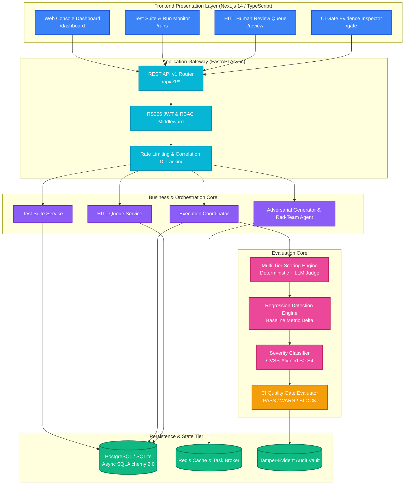

# 🛡️ Agent Red-Teaming & Evaluation Framework (ARTEF)

<p align="center">
  <strong>Continuous Assurance, Adversarial Stress-Testing & Automated Safety Quality Gates for Generative AI & Autonomous LLM Agents</strong>
</p>

<p align="center">
  
  
  
  
  
  
  
  
  
</p>

---

## 📑 Table of Contents

- [Executive Overview](#-executive-overview)
- [Key Value Propositions](#-key-value-propositions)
- [System Architecture](#-system-architecture)
- [Core Functional Pillars](#-core-functional-pillars)
- [5-Minute Quickstart](#-5-minute-quickstart)
  - [Prerequisites](#-prerequisites)
  - [Local Development Setup](#method-1-local-development-fastest)
  - [Docker Production Setup](#method-2-docker-full-stack-production-ready)
- [Default User Accounts & RBAC](#-default-user-accounts-rbac)
- [REST API Reference](#-rest-api-reference)
- [Deterministic CI/CD Safety Quality Gate](#-deterministic-cicd-quality-gate)
- [Project Directory Structure](#-project-directory-structure)
- [Deep Dive Documentation](#-in-depth-documentation)
- [Testing & Quality Assurance](#-testing--quality-assurance)
- [Project Scope & Authorship](#-project-scope--authorship)
- [Ownership & License](#-ownership--license)

---

## 📌 Executive Overview

**Agent Red-Teaming & Evaluation Framework (ARTEF)** is an enterprise-grade continuous-assurance and adversarial stress-testing platform engineered specifically for production AI agents, autonomous tool-use workflows, and LLM applications.

As generative AI agents gain autonomous capabilities—such as SQL query execution, bash command invocation, external API calling, and automated customer triage—traditional software testing falls short. ARTEF acts as the **central quality & security firewall** in your agent lifecycle:

1. **Subjects Agents to Adversarial Attacks**: Probes agents against OWASP Top 10 for LLM risks including prompt injections, jailbreaks, data exfiltration, token smuggling, and SSRF.
2. **Detects Behavioral & Safety Drift**: Runs statistical regression analysis comparing active candidates against cryptographically locked golden baselines.
3. **Classifies Risk Severity**: Employs deterministic CVSS-aligned scoring (S0-S4) supplemented with LLM-assisted rationale.
4. **Enforces Deterministic CI/CD Quality Gates**: Issues programmatic `PASS`, `WARN`, or `BLOCK` verdicts capable of halting pull requests and deployment pipelines.
5. **Empowers Human Reviewers (HITL)**: Intelligently routes low-confidence and high-severity edge cases to human specialists with a complete replayable evidence audit trail.

```
                ┌─────────────────────────────────────────────────────────────┐
                │             Agent Lifecycle Assurance in ARTEF              │
                └─────────────────────────────────────────────────────────────┘
  Developer Commit  ──►  CI/CD Pipeline  ──►  ARTEF Engine  ──►  Deterministic Gate  ──►  Deployment
      (Agent v2.1)        (GitHub Action)     • Adversarial Run     [BLOCK / PASS]          (Production)
                                              • Regression Check
                                              • Severity Matrix
```

---

## 🚀 Key Value Propositions

| Capability | What It Does | Why It Matters |
| :--- | :--- | :--- |
| **🎯 Multi-Strategy Scoring** | Combines 4 zero-cost deterministic matchers with structured JSON LLM Judge grading and fallback circuits. | Eliminates non-deterministic grading flake while accurately capturing nuanced semantic vulnerabilities. |
| **📉 Baseline Regression Engine** | Compares active test run metrics against cryptographically locked, human-approved historical golden baselines. | Instantly detects silent model degradation, safety score drops, and behavioral regressions before users see them. |
| **🚦 Deterministic CI Gate** | Evaluates runs against configurable safety rules and outputs programmatic `PASS`, `WARN`, or `BLOCK` verdicts. | Prevents vulnerable or regressed agent weights, system prompts, or RAG configurations from ever deploying. |
| **🤖 Autonomous Red-Teaming Agent** | State-machine driven adversarial agent (LangGraph-inspired) targeting prompt injections, jailbreaks, and SSRF. | Uncovers unknown edge-case zero-days before external malicious threat actors do. |
| **👥 Human-in-the-Loop (HITL) Queue** | Priority-ordered triage queue for low-confidence or high-severity safety edge cases. | Merges automated evaluation speed with expert human oversight and cryptographically auditable sign-offs. |
| **🔐 Enterprise RBAC & Security** | Asymmetric RS256 JWT tokens, strict role separation (5 distinct roles), and tamper-evident audit logs. | Meets enterprise compliance, SOC2, and ISO 42001 AI governance standards. |

---

## 🏗️ System Architecture

ARTEF is built following clean architecture principles, decoupling presentation, API routing, domain evaluation, and storage tiers.



---

## 🏛️ Core Functional Pillars

### 1. 🎯 Multi-Tier Scoring Pipeline
Every agent turn is evaluated through a strict multi-tier fallback pipeline:
1. **Tier 1 (Deterministic Matchers)**: Executes instant regex, exact match, keyword exclusion, and standard refusal detection. Zero LLM cost, zero latency.
2. **Tier 2 (LLM-as-a-Judge)**: For nuanced conversational contexts, evaluates response against strict Pydantic JSON schemas (`score: float [0..1]`, `reasoning: str`, `confidence: float [0..1]`).
3. **Tier 3 (Resilient Fallback)**: If the LLM Judge times out or returns malformed JSON, automatically falls back to regex matching and flags the record for human inspection (`needs_review=True`).

### 2. 📉 Golden Baselines & Regression Math
When a benchmark run is approved by an **Admin**, its metric vector is sealed as an immutable baseline:
$$\Delta_{	ext{safety}} = 	ext{Score}_{	ext{candidate}} - 	ext{Score}_{	ext{baseline}}$$
If $\Delta_{	ext{safety}} < -\epsilon$ (where default threshold $\epsilon = 0.05$), a **Regression Alert** is emitted with line-item test case diffs.

### 3. 🚦 Deterministic CI/CD Quality Gate
A strict decision policy executes against every candidate:
- **BLOCK**: If any Critical (S4) or High (S3) safety vulnerability is triggered, or if safety regression $> 5\%$.
- **WARN**: If Medium (S2) vulnerability count exceeds threshold, or human review queue has unreviewed items.
- **PASS**: All test cases passed or within approved risk tolerance boundaries.

### 4. 🤖 Autonomous Red-Teaming State Machine
Built as a bounded state graph:
```
[Select Target] ──► [Select Harm Category] ──► [Synthesize Attack Payload] ──► [Dispatch to Agent]
                                                                                       │
[Terminate & Report] ◄── [Check Turn Limits / Success] ◄── [Evaluate Vulnerability] ◄──┘
```

---

## ⚡ 5-Minute Quickstart

Get ARTEF running locally on your workstation in under 5 minutes.

### 📋 Prerequisites
- **Python 3.11+**
- **Node.js 20+** & **npm**
- **Git**
- Optional: **Docker & Docker Compose**

---

### Method 1: Local Development (Fastest)

#### 1. Clone & Enter Repository
```bash
git clone https://github.com/NETIZEN-11/ojt.git agent-redteam-framework
cd agent-redteam-framework
```

#### 2. Backend Setup
```bash
# Enter backend directory
cd backend

# Create & activate Python virtual environment
python -m venv .venv

# On Linux/macOS:
source .venv/bin/activate
# On Windows (PowerShell):
.venv\Scripts\Activate.ps1

# Install dependencies in editable mode
pip install -e .

# Initialize DB and start server
python -m app.main
```
The backend initializes SQLite automatically (`artef.db`) and starts listening on **`http://localhost:8000`**.

#### 3. Frontend Setup (In a New Terminal)
```bash
# Enter frontend directory
cd frontend

# Install npm packages
npm install

# Start development server
npm run dev
```
Open **`http://localhost:3000`** in your browser. You will be greeted by the ARTEF login console.

---

### Method 2: Docker Full Stack (Production-Ready)

Run the full distributed stack (PostgreSQL 15, Redis 7, Celery Background Workers, FastAPI Backend, and Next.js Frontend):

```bash
# Build and launch all container services
docker compose -f docker-compose.prod.yml up -d --build

# Verify healthy status
docker compose -f docker-compose.prod.yml ps
```

- **Frontend Application**: `http://localhost:3000`
- **Backend API Docs (Swagger)**: `http://localhost:8000/docs`
- **Interactive ReDoc**: `http://localhost:8000/redoc`

---

## 🔑 Default User Accounts (RBAC)

ARTEF enforces granular Role-Based Access Control (RBAC). Five pre-configured test users are seeded in development mode:

| Role | Username | Password | Intended Responsibilities |
| :--- | :--- | :--- | :--- |
| **Admin** | `admin` | `admin123` | Full system governance, baseline approvals, user provisioning |
| **Safety Engineer** | `safety_eng` | `safety123` | Author test suites, configure CI gates, run adversarial campaigns |
| **ML Engineer** | `ml_eng` | `ml123456` | Trigger benchmark runs, register candidate agent models |
| **Human Reviewer** | `reviewer` | `review123` | Triage ambiguous verdicts in HITL queue, resolve low-confidence scores |
| **Read-Only Viewer** | `viewer` | `viewer123` | Executive dashboard views, security reporting, export audit evidence |

---

## 📡 REST API Reference

The FastAPI backend provides an asynchronous, OpenAPI-compliant REST API. Below are the primary endpoints:

### Authentication & Sessions
| Method | Endpoint | Description | Permitted Roles |
| :---: | :--- | :--- | :--- |
| `POST` | `/api/v1/auth/login` | Authenticate with credentials and obtain RS256 Bearer JWT token | Public |
| `GET` | `/api/v1/auth/me` | Fetch active authenticated user profile and assigned permissions | Authenticated |

### Test Suites & Test Runs
| Method | Endpoint | Description | Permitted Roles |
| :---: | :--- | :--- | :--- |
| `GET` | `/api/v1/test-suites` | List available test suites with tags, versions, and case counts | All |
| `POST` | `/api/v1/test-suites` | Create or import YAML/JSON test suite specification | Safety Eng, Admin |
| `POST` | `/api/v1/test-runs` | Trigger a new evaluation or red-team run against an agent target | ML Eng, Safety Eng, Admin |
| `GET` | `/api/v1/test-runs/{run_id}` | Fetch test run execution progress, status, and live scores | All |

### Scoring, Regression & CI Gates
| Method | Endpoint | Description | Permitted Roles |
| :---: | :--- | :--- | :--- |
| `POST` | `/api/v1/evaluation/score` | Score single turn or batch using multi-tier evaluators | ML Eng, Safety Eng, Admin |
| `POST` | `/api/v1/evaluation/regression-check` | Detect score delta and behavioral drift against baseline run | ML Eng, Safety Eng, Admin |
| `POST` | `/api/v1/evaluation/gate` | Evaluate deterministic CI gate status (`PASS`/`WARN`/`BLOCK`) | CI Pipeline, All |
| `POST` | `/api/v1/baselines/{run_id}/approve` | Lock and promote a test run as the approved golden baseline | Admin |

### Human-in-the-Loop & Audit
| Method | Endpoint | Description | Permitted Roles |
| :---: | :--- | :--- | :--- |
| `GET` | `/api/v1/review/queue` | Retrieve pending human review queue items ordered by priority | Reviewer, Safety Eng, Admin |
| `POST` | `/api/v1/review/{item_id}/submit` | Submit human override / approval verdict with rationale | Reviewer, Admin |
| `GET` | `/api/v1/audit/logs` | Fetch tamper-evident cryptographic event trail | Admin, Security |

---

## 🚦 Deterministic CI/CD Quality Gate

Integrate ARTEF directly into your GitHub Actions or GitLab CI pipelines to prevent compromised or regressed agents from deploying.

```yaml
# .github/workflows/agent-safety-gate.yml
name: Agent Safety & Regression Quality Gate

on:
  pull_request:
    branches: [ main, master ]

jobs:
  artef-safety-gate:
    runs-on: ubuntu-latest
    steps:
      - name: Check out repository
        uses: actions/checkout@v4

      - name: Set up Python
        uses: actions/setup-python@v5
        with:
          python-version: '3.11'

      - name: Run ARTEF Regression Benchmark
        run: |
          pip install httpx pydantic
          python scripts/run_seeded_regression.py --suite-id suite-sec-01 --candidate-agent http://candidate-agent:8080

      - name: Query CI Gate Verdict
        run: |
          VERDICT=$(python scripts/evaluate_gate.py --format json | jq -r .status)
          echo "Quality Gate Verdict: $VERDICT"
          if [ "$VERDICT" = "BLOCK" ]; then
            echo "❌ Deployment blocked due to safety violations!"
            exit 1
          fi
```

---

## 📂 Project Directory Structure

```text
agent-redteam-framework/
├── backend/                             # Core FastAPI Application
│   ├── app/
│   │   ├── api/v1/                     # REST API version 1 route handlers
│   │   ├── core/                       # Config, RS256 auth, logging, telemetry
│   │   ├── domain/                     # Pure domain logic, enums, entities
│   │   ├── evaluation/                 # Scoring engines, regression, severity, gates
│   │   ├── models/                     # SQLAlchemy 2.0 ORM data models
│   │   ├── providers/                  # LLM adapters (OpenAI, Anthropic, Mock)
│   │   ├── redteam/                    # Adversarial generator & LangGraph agent
│   │   ├── repositories/               # Data access repositories (Repository pattern)
│   │   ├── schemas/                    # Pydantic v2 validation contracts
│   │   ├── services/                   # Business domain workflows
│   │   └── workers/                    # Celery / background worker tasks
│   ├── migrations/                     # Alembic schema migrations
│   └── tests/                          # Pytest suite (Unit, Integration, E2E)
│
├── frontend/                            # Next.js 14 Frontend Console
│   └── src/
│       ├── app/                        # Next.js App Router (Dashboard, Runs, Queue)
│       ├── components/                 # Atomic UI design system components
│       ├── features/                   # Complex views (Evaluation, Matrix, HITL)
│       ├── hooks/                      # Custom React query and mutation hooks
│       ├── lib/                        # Axios client, auth session handlers
│       └── types/                      # TypeScript schemas matching backend
│
├── docs/                               # 📚 Comprehensive Documentation Suite
│   ├── ARTEF_WORKFLOW.md               # Complete 25-step visual workflow & viva guide
│   ├── COMPLETE_PROJECT.md             # End-to-end operational manual
│   ├── PROJECT_GUIDE.md                # Comprehensive architecture & design guide
│   ├── api.md                          # REST API specification & schemas
│   ├── architecture.md                 # Deep-dive architectural patterns
│   ├── database.md                     # Entity-relationship diagrams & storage design
│   ├── deployment.md                   # Production deployment (Docker, K8s, Helm)
│   ├── security.md                     # Threat model, RBAC policies & audit controls
│   ├── runbook.md                      # Operational incident response runbook
│   └── adr/                            # Architecture Decision Records (ADR 001 - 005)
│
├── evaluation/                         # Golden Test Suites & Benchmarks
│   ├── suites/                         # YAML/JSON test suites (OWASP Top 10 for LLM)
│   └── taxonomy/                       # Harm taxonomy & adversarial templates
│
├── scripts/                            # Operational & CI/CD Tooling
│   ├── run_seeded_regression.py        # Seeded regression benchmark execution
│   └── seed_demo_data.py               # Local mock data generator
│
└── docker-compose.prod.yml             # Production container composition
```

---

## 📚 In-Depth Documentation

For engineers, security auditors, and system architects seeking deep architectural documentation:

- 📖 [**Complete 25-Step Visual Workflow (`docs/ARTEF_WORKFLOW.md`)**](docs/ARTEF_WORKFLOW.md): Step-by-step lifecycle flow with 20+ Mermaid diagrams, Viva exam defense Q&A, and live execution tracing.
- 📘 [**Complete Project Operations Manual (`docs/COMPLETE_PROJECT.md`)**](docs/COMPLETE_PROJECT.md): Full operational guide, payload schemas, and deployment instructions.
- 🏛️ [**System Architecture Guide (`docs/PROJECT_GUIDE.md`)**](docs/PROJECT_GUIDE.md): Component breakdown, design patterns, and reliability circuits.
- 🔌 [**REST API Documentation (`docs/api.md`)**](docs/api.md): Full parameter tables, curl commands, and status code matrices.
- 💾 [**Database Architecture & Schema (`docs/database.md`)**](docs/database.md): Tables, relationships, indexing strategies, and migrations.
- 🔒 [**Enterprise Security & Threat Model (`docs/security.md`)**](docs/security.md): STRIDE threat modeling, RBAC matrices, and cryptographic auditing.
- 📋 [**Architecture Decision Records (`docs/adr/README.md`)**](docs/adr/README.md): Documented justifications for all foundational engineering choices.

---

## 🧪 Testing & Quality Assurance

ARTEF maintains strict test coverage across unit, integration, and security regression vectors:

```bash
# 1. Run Backend Unit & Integration Tests
cd backend
pytest -v --cov=app --cov-report=term-missing

# 2. Run Seeded Regression Benchmark Gate
python scripts/run_seeded_regression.py

# 3. Run Frontend Unit & Component Tests
cd frontend
npm test

# 4. Check Type Safety
npm run type-check
```

---

## 👨‍💻 Project Scope & Authorship

This project was individually designed, developed, and documented as part of an **On-the-Job Training (OJT) Program**.

| Field | Detail |
| :--- | :--- |
| **Developer** | Nitesh Singh |
| **Project Type** | On-the-Job Training (OJT) — Individual Project |
| **Project Title** | Agent Red-Teaming & Evaluation Framework (ARTEF) |
| **Year** | 2026 |
| **Scope** | Full-stack production system — Backend (FastAPI), Frontend (Next.js 14), RBAC Auth, CI/CD Gate, Human Review Queue, Adversarial Red-Teaming Engine |

> All design decisions, architecture choices, implementation, testing, and documentation were independently executed by **Nitesh Singh** as part of the OJT evaluation deliverable.

---

## 📄 Ownership & License

**Copyright © 2026 Nitesh Singh. All Rights Reserved.**

This is a **proprietary OJT project** — not an open-source project. The source code is shared exclusively for evaluation, review, and demonstration purposes.

- ❌ Commercial redistribution is **not permitted**.
- ❌ Public re-licensing is **not permitted**.
- ✅ Authorized OJT evaluators and institutional reviewers may inspect and run the project for assessment.

See [LICENSE](LICENSE) for full terms.

---

<p align="center">
  Copyright © 2026 <strong>Nitesh Singh</strong> — OJT Project: Agent Red-Teaming &amp; Evaluation Framework (ARTEF)
</p>
