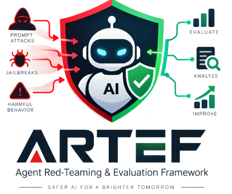
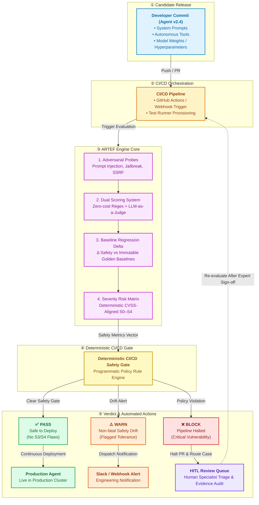
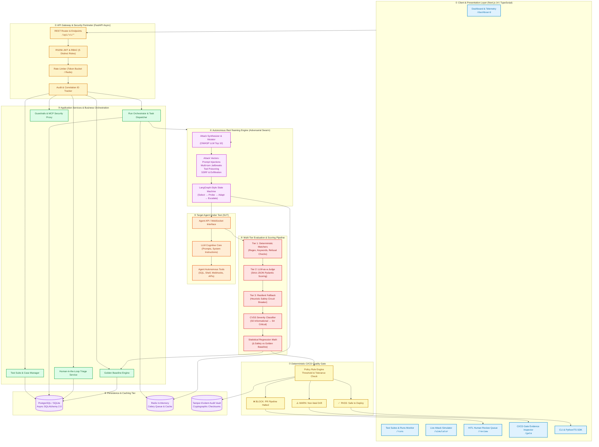

<div align="center">



# 🛡️ Agent Red-Teaming & Evaluation Framework

### **ARTEF** — Continuous Assurance, Adversarial Stress-Testing & Automated Safety Quality Gates for Production AI Agents

<br/>

[](https://fastapi.tiangolo.com)
[](https://python.org)
[](https://typescriptlang.org)
[](https://nextjs.org)
[](https://docker.com)

[](https://github.com/NETIZEN-11/ARTEF)
[](https://github.com/BYTEZEN-11)
[](LICENSE)
[](https://github.com/NETIZEN-11/ARTEF)

</div>

---

## 📑 Table of Contents

<details>
<summary><b>Click to expand</b></summary>

- [Executive Overview](#-executive-overview)
- [Key Value Propositions](#-key-value-propositions)
- [System Architecture](#-system-architecture)
- [Core Functional Pillars](#-core-functional-pillars)
  - [Multi-Tier Scoring Pipeline](#1--multi-tier-scoring-pipeline)
  - [Golden Baselines & Regression Math](#2--golden-baselines--regression-math)
  - [Deterministic CI/CD Quality Gate](#3--deterministic-cicd-quality-gate)
  - [Autonomous Red-Teaming State Machine](#4--autonomous-red-teaming-state-machine)
- [5-Minute Quickstart](#-5-minute-quickstart)
  - [Prerequisites](#-prerequisites)
  - [Local Development](#method-1-local-development-fastest)
  - [Docker Full Stack](#method-2-docker-full-stack-production-ready)
- [REST API Reference](#-rest-api-reference)
- [CI/CD Safety Gate](#-deterministic-cicd-quality-gate-1)
- [Project Structure](#-project-directory-structure)
- [Documentation](#-in-depth-documentation)
- [Testing & QA](#-testing--quality-assurance)
- [Authorship](#-project-scope--authorship)
- [License](#-ownership--license)

</details>

---

## 📌 Executive Overview

> **ARTEF** is an enterprise-grade continuous-assurance and adversarial stress-testing platform engineered specifically for production AI agents, autonomous tool-use workflows, and LLM applications.

ARTEF addresses the critical gap between deploying AI agents and knowing they are safe. It:

1. 🎯 **Subjects Agents to Adversarial Attacks** — Probes agents against OWASP Top 10 for LLM risks: prompt injections, jailbreaks, data exfiltration, token smuggling, and SSRF.
2. 📉 **Detects Behavioral & Safety Drift** — Runs statistical regression analysis comparing active candidates against cryptographically locked golden baselines.
3. 🏷️ **Classifies Risk Severity** — Employs deterministic CVSS-aligned scoring (S0–S4) supplemented with LLM-assisted rationale.
4. 🚦 **Enforces Deterministic CI/CD Quality Gates** — Issues programmatic `PASS`, `WARN`, or `BLOCK` verdicts capable of halting pull requests and deployment pipelines.
5. 👥 **Empowers Human Reviewers (HITL)** — Intelligently routes low-confidence and high-severity edge cases to human specialists with a complete replayable evidence audit trail.



---

## 🚀 Key Value Propositions

| Capability | What It Does | Why It Matters |
| :--- | :--- | :--- |
| 🎯 **Multi-Strategy Scoring** | Combines 4 zero-cost deterministic matchers with structured JSON LLM Judge grading and fallback circuits. | Eliminates non-deterministic grading flake while accurately capturing nuanced semantic vulnerabilities. |
| 📉 **Baseline Regression Engine** | Compares active test run metrics against cryptographically locked, human-approved historical golden baselines. | Instantly detects silent model degradation, safety score drops, and behavioral regressions before users see them. |
| 🚦 **Deterministic CI Gate** | Evaluates runs against configurable safety rules and outputs programmatic `PASS`, `WARN`, or `BLOCK` verdicts. | Prevents vulnerable or regressed agent weights, system prompts, or RAG configurations from ever deploying. |
| 🤖 **Autonomous Red-Teaming Agent** | State-machine driven adversarial agent (LangGraph-inspired) targeting prompt injections, jailbreaks, and SSRF. | Uncovers unknown edge-case zero-days before external malicious threat actors do. |
| 👥 **Human-in-the-Loop (HITL) Queue** | Priority-ordered triage queue for low-confidence or high-severity safety edge cases. | Merges automated evaluation speed with expert human oversight and cryptographically auditable sign-offs. |
| 🔐 **Enterprise RBAC & Security** | Asymmetric RS256 JWT tokens, strict role separation (5 distinct roles), and tamper-evident audit logs. | Meets enterprise compliance, SOC2, and ISO 42001 AI governance standards. |

---

## 🏗️ System Architecture

ARTEF is built following clean modular architecture principles, decoupling presentation, API routing, autonomous adversarial generation, multi-tier evaluation, and deterministic CI/CD policy gates into distinct layers.



---

## 🏛️ Core Functional Pillars

### 1. 🎯 Multi-Tier Scoring Pipeline

Every agent turn is evaluated through a strict **multi-tier fallback pipeline**:

| Tier | Name | Mechanism | Cost |
|:---:|:---|:---|:---:|
| **T1** | Deterministic Matchers | Regex, exact match, keyword exclusion, refusal detection | Zero |
| **T2** | LLM-as-a-Judge | Strict Pydantic JSON schemas — `score: float [0..1]`, `reasoning: str`, `confidence: float [0..1]` | Low |
| **T3** | Resilient Fallback | Auto-fallback on timeout/malformed JSON → regex + `needs_review=True` flag | Zero |

### 2. 📉 Golden Baselines & Regression Math

When a benchmark run is approved by an **Admin**, its metric vector is sealed as an **immutable baseline**:

$$\Delta_{\text{safety}} = \text{Score}_{\text{candidate}} - \text{Score}_{\text{baseline}}$$

> If $\Delta_{\text{safety}} < -\epsilon$ (default threshold $\epsilon = 0.05$), a **Regression Alert** is emitted with line-item test case diffs.

### 3. 🚦 Deterministic CI/CD Quality Gate

A strict decision policy executes against every candidate:

```
❌ BLOCK  ──  Any Critical (S4) or High (S3) vulnerability triggered
             OR safety regression > 5%

⚠️ WARN   ──  Medium (S2) vulnerability count exceeds threshold
             OR human review queue has unreviewed items

✅ PASS   ──  All test cases passed or within approved risk tolerance
```

### 4. 🤖 Autonomous Red-Teaming State Machine

Built as a **bounded state graph**:

```
[Select Target] ──► [Select Harm Category] ──► [Synthesize Attack Payload] ──► [Dispatch to Agent]
                                                                                        │
[Terminate & Report] ◄── [Check Turn Limits / Success] ◄── [Evaluate Vulnerability] ◄──┘
```

---

## ⚡ 5-Minute Quickstart

> Get ARTEF running locally on your workstation in under **5 minutes**.

### 📋 Prerequisites

| Requirement | Version | Notes |
|:---|:---:|:---|
| Python | 3.11+ | Required for backend |
| Node.js & npm | 20+ | Required for frontend |
| Git | Latest | For cloning |
| Docker & Compose | Latest | Optional — for full stack |

---

### Method 1: Local Development (Fastest)

**① Clone & Enter Repository**
```bash
git clone https://github.com/NETIZEN-11/ojt.git agent-redteam-framework
cd agent-redteam-framework
```

**② Backend Setup**
```bash
cd backend

# Create & activate virtual environment
python -m venv .venv

# Linux/macOS
source .venv/bin/activate

# Windows (PowerShell)
.venv\Scripts\Activate.ps1

# Install dependencies
pip install -e .

# Initialize DB & start server
python -m app.main
```

> The backend auto-initializes SQLite (`artef.db`) and starts on **`http://localhost:8000`**

**③ Frontend Setup** *(new terminal)*
```bash
cd frontend
npm install
npm run dev
```

> Open **`http://localhost:3000`** — you'll be greeted by the ARTEF login console.

---

### Method 2: Docker Full Stack (Production-Ready)

Run the complete distributed stack — **PostgreSQL 15**, **Redis 7**, **Celery Workers**, **FastAPI**, and **Next.js** — in a single command:

```bash
# Build & launch all services
docker compose -f docker-compose.prod.yml up -d --build

# Verify all containers are healthy
docker compose -f docker-compose.prod.yml ps
```

| Service | URL |
|:---|:---|
| Frontend Application | `http://localhost:3000` |
| Backend API (Swagger) | `http://localhost:8000/docs` |
| Interactive ReDoc | `http://localhost:8000/redoc` |

---

## 📡 REST API Reference

The FastAPI backend provides an **asynchronous, OpenAPI-compliant** REST API.

### 🔐 Authentication & Sessions

| Method | Endpoint | Description | Roles |
|:---:|:---|:---|:---|
| `POST` | `/api/v1/auth/login` | Authenticate & obtain RS256 Bearer JWT | Public |
| `GET` | `/api/v1/auth/me` | Fetch active user profile & permissions | Authenticated |

### 🧪 Test Suites & Runs

| Method | Endpoint | Description | Roles |
|:---:|:---|:---|:---|
| `GET` | `/api/v1/test-suites` | List test suites with tags, versions, case counts | All |
| `POST` | `/api/v1/test-suites` | Create or import YAML/JSON test suite | Safety Eng, Admin |
| `POST` | `/api/v1/test-runs` | Trigger evaluation or red-team run | ML Eng, Safety Eng, Admin |
| `GET` | `/api/v1/test-runs/{run_id}` | Fetch run progress, status, live scores | All |

### 📊 Scoring, Regression & CI Gates

| Method | Endpoint | Description | Roles |
|:---:|:---|:---|:---|
| `POST` | `/api/v1/evaluation/score` | Score single turn or batch via multi-tier evaluators | ML Eng, Safety Eng, Admin |
| `POST` | `/api/v1/evaluation/regression-check` | Detect score delta & behavioral drift vs baseline | ML Eng, Safety Eng, Admin |
| `POST` | `/api/v1/evaluation/gate` | Evaluate CI gate status (`PASS`/`WARN`/`BLOCK`) | CI Pipeline, All |
| `POST` | `/api/v1/baselines/{run_id}/approve` | Lock & promote run as approved golden baseline | Admin |

### 👥 Human-in-the-Loop & Audit

| Method | Endpoint | Description | Roles |
|:---:|:---|:---|:---|
| `GET` | `/api/v1/review/queue` | Retrieve pending review queue by priority | Reviewer, Safety Eng, Admin |
| `POST` | `/api/v1/review/{item_id}/submit` | Submit human override / approval verdict | Reviewer, Admin |
| `GET` | `/api/v1/audit/logs` | Fetch tamper-evident cryptographic event trail | Admin, Security |

---

## 🚦 Deterministic CI/CD Quality Gate

Integrate ARTEF directly into **GitHub Actions** or **GitLab CI** pipelines to prevent compromised or regressed agents from deploying.

```yaml
# .github/workflows/agent-safety-gate.yml
name: Agent Safety & Regression Quality Gate

on:
  pull_request:
    branches: [ main, master ]

jobs:
  artef-safety-gate:
    runs-on: ubuntu-latest
    steps:
      - name: Check out repository
        uses: actions/checkout@v4

      - name: Set up Python
        uses: actions/setup-python@v5
        with:
          python-version: '3.11'

      - name: Run ARTEF Regression Benchmark
        run: |
          pip install httpx pydantic
          python scripts/run_seeded_regression.py \
            --suite-id suite-sec-01 \
            --candidate-agent http://candidate-agent:8080

      - name: Query CI Gate Verdict
        run: |
          VERDICT=$(python scripts/evaluate_gate.py --format json | jq -r .status)
          echo "Quality Gate Verdict: $VERDICT"
          if [ "$VERDICT" = "BLOCK" ]; then
            echo "❌ Deployment blocked due to safety violations!"
            exit 1
          fi
```

---

## 📂 Project Directory Structure

```text
agent-redteam-framework/
│
├── backend/                             # ⚙️  Core FastAPI Application
│   ├── app/
│   │   ├── api/v1/                     # REST API v1 route handlers
│   │   ├── core/                       # Config, RS256 auth, logging, telemetry
│   │   ├── domain/                     # Pure domain logic, enums, entities
│   │   ├── evaluation/                 # Scoring engines, regression, severity, gates
│   │   ├── models/                     # SQLAlchemy 2.0 ORM data models
│   │   ├── providers/                  # LLM adapters (OpenAI, Anthropic, Mock)
│   │   ├── redteam/                    # Adversarial generator & LangGraph agent
│   │   ├── repositories/               # Data access layer (Repository pattern)
│   │   ├── schemas/                    # Pydantic v2 validation contracts
│   │   ├── services/                   # Business domain workflows
│   │   └── workers/                    # Celery / background worker tasks
│   ├── migrations/                     # Alembic schema migrations
│   └── tests/                          # Pytest suite (Unit, Integration, E2E)
│
├── frontend/                            # 🖥️  Next.js 14 Frontend Console
│   └── src/
│       ├── app/                        # App Router (Dashboard, Runs, Queue)
│       ├── components/                 # Atomic UI design system components
│       ├── features/                   # Complex views (Evaluation, Matrix, HITL)
│       ├── hooks/                      # Custom React query & mutation hooks
│       ├── lib/                        # Axios client, auth session handlers
│       └── types/                      # TypeScript schemas matching backend
│
├── docs/                               # 📚 Comprehensive Documentation Suite
│   ├── ARTEF_WORKFLOW.md               # 25-step visual workflow & viva guide
│   ├── COMPLETE_PROJECT.md             # End-to-end operational manual
│   ├── PROJECT_GUIDE.md                # Architecture & design guide
│   ├── api.md                          # REST API specification & schemas
│   ├── architecture.md                 # Deep-dive architectural patterns
│   ├── database.md                     # ER diagrams & storage design
│   ├── deployment.md                   # Docker, K8s, Helm deployment guide
│   ├── security.md                     # Threat model, RBAC & audit controls
│   ├── runbook.md                      # Operational incident response runbook
│   └── adr/                            # Architecture Decision Records (001–005)
│
├── evaluation/                         # 🧪 Golden Test Suites & Benchmarks
│   ├── suites/                         # YAML/JSON suites (OWASP LLM Top 10)
│   └── taxonomy/                       # Harm taxonomy & adversarial templates
│
├── scripts/                            # 🔧 Operational & CI/CD Tooling
│   ├── run_seeded_regression.py        # Seeded regression benchmark runner
│   └── seed_demo_data.py               # Local mock data generator
│
└── docker-compose.prod.yml             # 🐳 Production container composition
```

---

## 📚 In-Depth Documentation

<div align="center">

| Document | Description |
|:---|:---|
| 📖 [**ARTEF Workflow** (`docs/ARTEF_WORKFLOW.md`)](docs/ARTEF_WORKFLOW.md) | Complete 25-step lifecycle flow with 20+ Mermaid diagrams, viva Q&A, and live execution tracing |
| 📘 [**Operations Manual** (`docs/COMPLETE_PROJECT.md`)](docs/COMPLETE_PROJECT.md) | Full operational guide, payload schemas, and deployment instructions |
| 🏛️ [**Architecture Guide** (`docs/PROJECT_GUIDE.md`)](docs/PROJECT_GUIDE.md) | Component breakdown, design patterns, and reliability circuits |
| 🔌 [**REST API Docs** (`docs/api.md`)](docs/api.md) | Full parameter tables, curl commands, and status code matrices |
| 💾 [**Database Schema** (`docs/database.md`)](docs/database.md) | Tables, relationships, indexing strategies, and migrations |
| 🔒 [**Security & Threat Model** (`docs/security.md`)](docs/security.md) | STRIDE threat modeling, RBAC matrices, and cryptographic auditing |
| 📋 [**Architecture Decision Records** (`docs/adr/`)](docs/adr/README.md) | Documented justifications for all foundational engineering choices |

</div>

---

## 🧪 Testing & Quality Assurance

ARTEF maintains strict test coverage across **unit**, **integration**, and **security regression** vectors:

```bash
# ① Backend unit & integration tests
cd backend
pytest -v --cov=app --cov-report=term-missing

# ② Seeded regression benchmark gate
python scripts/run_seeded_regression.py

# ③ Frontend unit & component tests
cd frontend
npm test

# ④ TypeScript type safety check
npm run type-check
```

---

## 👨‍💻 Project Scope & Authorship

> This project was individually designed, developed, and documented as part of an **On-the-Job Training (OJT) Program**.

<div align="center">

| Field | Detail |
|:---|:---|
| **Developer** | Nitesh Singh |
| **GitHub** | [@BYTEZEN-11](https://github.com/BYTEZEN-11) |
| **Project Type** | On-the-Job Training (OJT) — Individual Project |
| **Project Title** | Agent Red-Teaming & Evaluation Framework (ARTEF) |
| **Year** | 2026 |
| **Scope** | Full-stack production system — FastAPI Backend, Next.js 14 Frontend, RBAC Auth, CI/CD Safety Gate, Human Review Queue, Adversarial Red-Teaming Engine |

</div>

> All design decisions, architecture choices, implementation, testing, and documentation were independently executed by **Nitesh Singh** as part of the OJT evaluation deliverable.

---

## 📄 Ownership & License

<div align="center">

**Copyright © 2026 Nitesh Singh. All Rights Reserved.**

This is a **proprietary OJT project** — not an open-source project. Source code is shared exclusively for evaluation, review, and demonstration purposes.

| | Permission |
|:---|:---:|
| ❌ Commercial redistribution | Not permitted |
| ❌ Public re-licensing | Not permitted |
| ✅ OJT evaluator / institutional review | Authorized |

See [LICENSE](LICENSE) for full terms.

</div>

---

<div align="center">

**🛡️ ARTEF — Built for the Future of Safe AI**

*Copyright © 2026 **Nitesh Singh** — OJT Project: Agent Red-Teaming & Evaluation Framework*

[](https://github.com/NETIZEN-11/ARTEF)
[](https://github.com/BYTEZEN-11)

</div>
