# ARTEF — Complete Project Workflow

> **Document Version**: 2.0.0 (Production Edition)
> **Purpose**: End-to-End Step-by-Step Working, Architecture, Components, APIs, Database, Evaluation Flow, Red Teaming, and Release Gate

---

## Table of Contents

1. [Project in One Line](#1-project-in-one-line)
2. [Complete Main Workflow Diagram](#2-complete-main-workflow-diagram)
3. [Step 1 — Evaluation Request](#3-step-1--evaluation-request)
4. [Step 2 — Configuration Loading](#4-step-2--configuration-loading)
5. [Step 3 — Configuration Validation](#5-step-3--configuration-validation)
6. [Step 4 — Evaluation Matrix Generation](#6-step-4--evaluation-matrix-generation)
7. [Step 5 — Scheduler](#7-step-5--scheduler)
8. [Step 6 — Worker Execution](#8-step-6--worker-execution)
9. [Step 7 — Provider Adapter](#9-step-7--provider-adapter)
10. [Step 8 — Target AI Model / Agent](#10-step-8--target-ai-model--agent)
11. [Step 9 — Response Collection](#11-step-9--response-collection)
12. [Step 10 — Assertions Engine](#12-step-10--assertions-engine)
13. [Step 11 — AI Judge](#13-step-11--ai-judge)
14. [Step 12 — Red-Team Engine](#14-step-12--red-team-engine)
15. [Step 13 — Safety & Security Checks](#15-step-13--safety--security-checks)
16. [Step 14 — Model Security Scanner](#16-step-14--model-security-scanner)
17. [Step 15 — Result Aggregation](#17-step-15--result-aggregation)
18. [Step 16 — Evidence & Traceability](#18-step-16--evidence--traceability)
19. [Step 17 — Database Storage](#19-step-17--database-storage)
20. [Step 18 — Baseline Comparison](#20-step-18--baseline-comparison)
21. [Step 19 — Regression Detection](#21-step-19--regression-detection)
22. [Step 20 — Severity Classification](#22-step-20--severity-classification)
23. [Step 21 — Threshold Engine](#23-step-21--threshold-engine)
24. [Step 22 — Human Review Queue](#24-step-22--human-review-queue)
25. [Step 23 — Release Readiness](#25-step-23--release-readiness)
26. [Step 24 — Reporting](#26-step-24--reporting)
27. [Step 25 — CI/CD Quality Gate](#27-step-25--cicd-quality-gate)
28. [Complete Data Flow Diagram](#28-complete-data-flow-diagram)
29. [Full System Architecture](#29-full-system-architecture)
30. [API Flow Sequence](#30-api-flow-sequence)
31. [Database Flow](#31-database-flow)
32. [RAG Evaluation Flow](#32-rag-evaluation-flow)
33. [AI Agent Evaluation Flow](#33-ai-agent-evaluation-flow)
34. [Failure Handling Scenarios](#34-failure-handling-scenarios)
35. [Security Model](#35-security-model)
36. [Architecture Rules](#36-architecture-rules)
37. [Master Audit Prompt](#37-master-audit-prompt)
38. [Viva & Interview Answers](#38-viva--interview-answers)
39. [One-Line Memory Trick](#39-one-line-memory-trick)

---

## 1. Project in One Line

> **ARTEF** is a **continuous AI assurance framework** that evaluates, attacks, compares, and analyzes AI systems before release — ensuring they are **Correct**, **Safe**, **Secure**, **Reliable**, and within configured **Performance & Cost thresholds**.

---

## 2. Complete Main Workflow Diagram

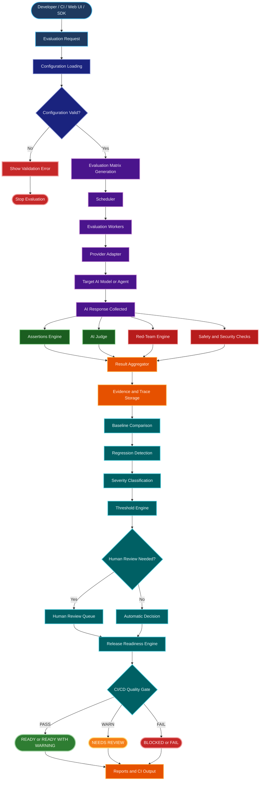
```mermaid
flowchart TD
    classDef client fill:#1e3a5f,stroke:#4fc3f7,stroke-width:2px,color:#e3f2fd
    classDef validate fill:#1a237e,stroke:#7986cb,stroke-width:2px,color:#e8eaf6
    classDef exec fill:#4a148c,stroke:#ce93d8,stroke-width:2px,color:#f3e5f5
    classDef eval fill:#1b5e20,stroke:#66bb6a,stroke-width:2px,color:#e8f5e9
    classDef security fill:#b71c1c,stroke:#ef9a9a,stroke-width:2px,color:#ffebee
    classDef store fill:#e65100,stroke:#ffb74d,stroke-width:2px,color:#fff3e0
    classDef decision fill:#006064,stroke:#4dd0e1,stroke-width:2px,color:#e0f7fa
    classDef gatePass fill:#2e7d32,stroke:#a5d6a7,stroke-width:3px,color:#f1f8e9
    classDef gateBlock fill:#c62828,stroke:#ef9a9a,stroke-width:3px,color:#ffebee
    classDef gateWarn fill:#f57f17,stroke:#ffe082,stroke-width:3px,color:#fffde7

    START([Developer / CI / Web UI / SDK]):::client --> REQ[Evaluation Request]:::client
    REQ --> CONF[Configuration Loading]:::validate
    CONF --> VAL{Configuration Valid?}:::validate

    VAL -- No --> ERR[Show Validation Error]:::gateBlock
    ERR --> STOP([Stop Evaluation]):::gateBlock

    VAL -- Yes --> MATRIX[Evaluation Matrix Generation]:::exec
    MATRIX --> SCHED[Scheduler]:::exec
    SCHED --> WORKERS[Evaluation Workers]:::exec

    WORKERS --> PROVIDER[Provider Adapter]:::exec
    PROVIDER --> TARGET[Target AI Model or Agent]:::exec
    TARGET --> RESPONSE[AI Response Collected]:::exec

    RESPONSE --> ASSERT[Assertions Engine]:::eval
    RESPONSE --> JUDGE[AI Judge]:::eval
    RESPONSE --> REDTEAM[Red-Team Engine]:::security
    RESPONSE --> SAFETY[Safety and Security Checks]:::security

    ASSERT --> AGG[Result Aggregator]:::store
    JUDGE --> AGG
    REDTEAM --> AGG
    SAFETY --> AGG

    AGG --> EVIDENCE[Evidence and Trace Storage]:::store
    EVIDENCE --> BASE[Baseline Comparison]:::decision
    BASE --> REG[Regression Detection]:::decision
    REG --> SEV[Severity Classification]:::decision
    SEV --> THRESH[Threshold Engine]:::decision

    THRESH --> REVIEW{Human Review Needed?}:::decision
    REVIEW -- Yes --> HMR[Human Review Queue]:::decision
    REVIEW -- No --> AUTO[Automatic Decision]:::decision

    HMR --> RELEASE[Release Readiness Engine]:::decision
    AUTO --> RELEASE

    RELEASE --> GATE{CI/CD Quality Gate}:::decision
    GATE -- PASS --> READY([READY or READY WITH WARNING]):::gatePass
    GATE -- WARN --> WARN([NEEDS REVIEW]):::gateWarn
    GATE -- FAIL --> BLOCK([BLOCKED or FAIL]):::gateBlock

    READY --> REPORT[Reports and CI Output]:::store
    WARN --> REPORT
    BLOCK --> REPORT
```

---

## 3. Step 1 — Evaluation Request

An evaluation can be started from **four entry points**:

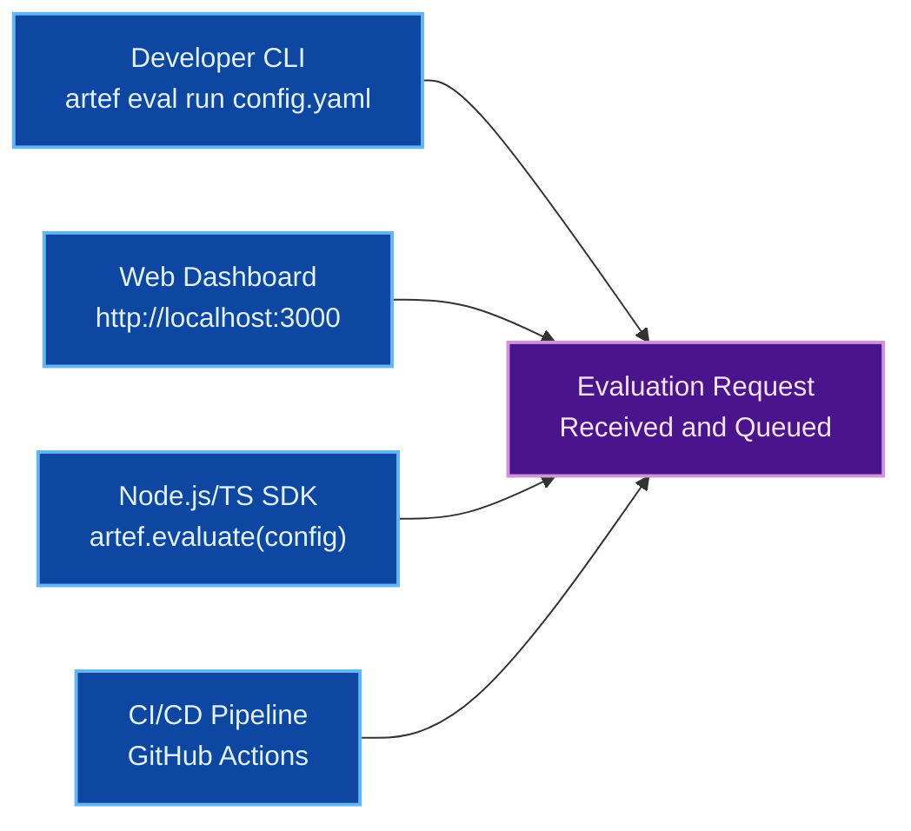
```mermaid
flowchart LR
    classDef entry fill:#0d47a1,stroke:#64b5f6,stroke-width:2px,color:#e3f2fd
    classDef core fill:#4a148c,stroke:#ce93d8,stroke-width:2px,color:#f3e5f5

    CLI["Developer CLI\nartef eval run config.yaml"]:::entry --> CORE
    WEB["Web Dashboard\nhttp://localhost:3000"]:::entry --> CORE
    SDK["Node.js/TS SDK\nartef.evaluate(config)"]:::entry --> CORE
    CICD["CI/CD Pipeline\nGitHub Actions"]:::entry --> CORE
    CORE["Evaluation Request\nReceived and Queued"]:::core
```

**What happens?** The system receives an evaluation request and identifies which configuration should be executed.

> **Viva Line**: *"First, the developer or CI/CD pipeline starts an evaluation using an evaluation configuration file."*

---

## 4. Step 2 — Configuration Loading

The configuration tells ARTEF **what to test** and **how to test it**.

```yaml
# Example: config.yaml
model: gpt-4o-mini
provider: openai
prompt: customer-support.yaml
dataset: support-tests.json
thresholds:
  accuracy: 0.90
  safety: 0.95
  max_latency: 3
  critical_findings: 0
red_team:
  enabled: true
  plugins: [jailbreak, prompt_injection, pii_leak]
output:
  format: [json, junit, html]
```

| Configuration Key | Purpose |
|---|---|
| `model` | Target AI model identifier |
| `provider` | AI provider (openai, anthropic, gemini, local) |
| `prompt` | Prompt template file |
| `dataset` | Test cases dataset |
| `thresholds` | Release quality thresholds |
| `red_team` | Adversarial attack configuration |
| `output` | Report format and destination |

---

## 5. Step 3 — Configuration Validation

Before making **any external AI request**, ARTEF validates the configuration completely.

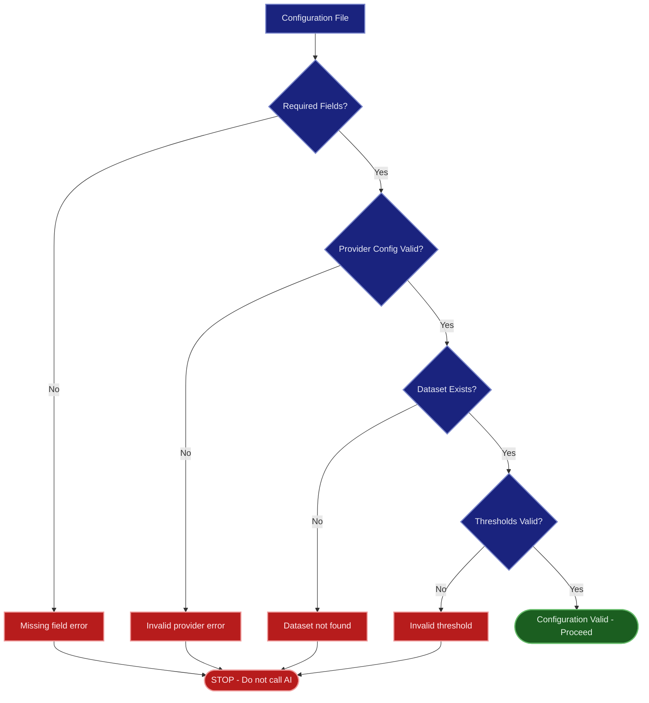
```mermaid
flowchart TD
    classDef ok fill:#1b5e20,stroke:#66bb6a,stroke-width:2px,color:#e8f5e9
    classDef err fill:#b71c1c,stroke:#ef9a9a,stroke-width:2px,color:#ffebee
    classDef check fill:#1a237e,stroke:#7986cb,stroke-width:2px,color:#e8eaf6

    CONF[Configuration File]:::check --> V1{Required Fields?}:::check
    V1 -- No --> E1[Missing field error]:::err
    V1 -- Yes --> V2{Provider Config Valid?}:::check
    V2 -- No --> E2[Invalid provider error]:::err
    V2 -- Yes --> V3{Dataset Exists?}:::check
    V3 -- No --> E3[Dataset not found]:::err
    V3 -- Yes --> V4{Thresholds Valid?}:::check
    V4 -- No --> E4[Invalid threshold]:::err
    V4 -- Yes --> VALID([Configuration Valid - Proceed]):::ok

    E1 --> STOP([STOP - Do not call AI]):::err
    E2 --> STOP
    E3 --> STOP
    E4 --> STOP
```

> **Viva Line**: *"Before calling the AI model, ARTEF validates the configuration so that invalid configurations do not reach the external provider."*

---

## 6. Step 4 — Evaluation Matrix Generation

ARTEF creates executable **evaluation cells** from all configured combinations.

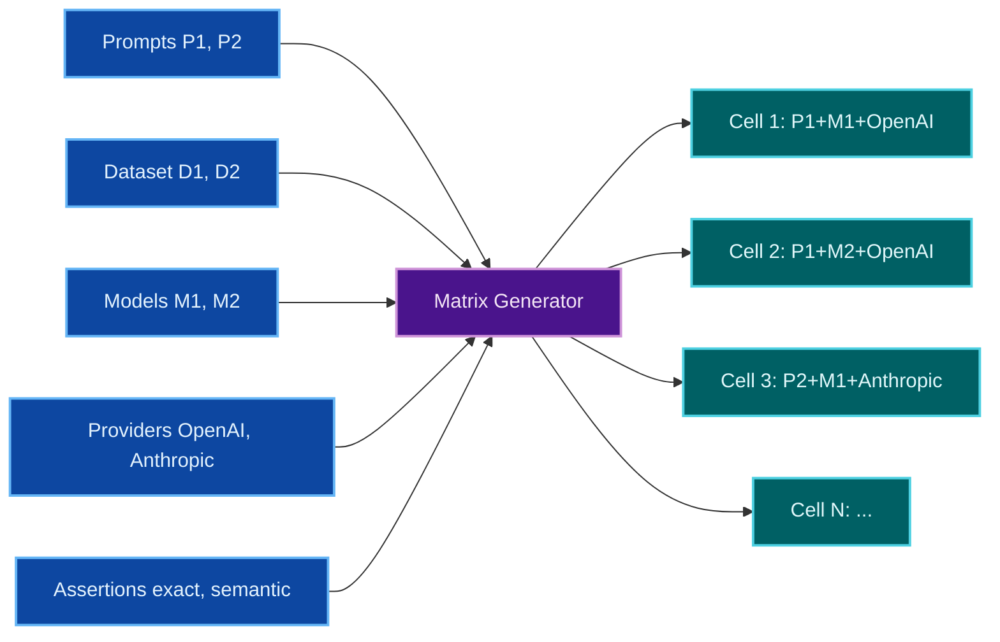
```mermaid
flowchart LR
    classDef input fill:#0d47a1,stroke:#64b5f6,stroke-width:2px,color:#e3f2fd
    classDef matrix fill:#4a148c,stroke:#ce93d8,stroke-width:2px,color:#f3e5f5
    classDef cell fill:#006064,stroke:#4dd0e1,stroke-width:2px,color:#e0f7fa

    P["Prompts P1, P2"]:::input --> M[Matrix Generator]:::matrix
    D["Dataset D1, D2"]:::input --> M
    MD["Models M1, M2"]:::input --> M
    PR["Providers OpenAI, Anthropic"]:::input --> M
    A["Assertions exact, semantic"]:::input --> M

    M --> C1["Cell 1: P1+M1+OpenAI"]:::cell
    M --> C2["Cell 2: P1+M2+OpenAI"]:::cell
    M --> C3["Cell 3: P2+M1+Anthropic"]:::cell
    M --> CN["Cell N: ..."]:::cell
```

| Cell | Prompt | Model | Provider | Assertions |
|---|---|---|---|---|
| Cell 1 | Customer Support | GPT-4o | OpenAI | exact_match + safety |
| Cell 2 | Customer Support | Claude-3 | Anthropic | exact_match + safety |
| Cell 3 | Order Cancel | GPT-4o | OpenAI | contains + semantic |
| Cell 4 | Order Cancel | Claude-3 | Anthropic | contains + semantic |

---

## 7. Step 5 — Scheduler

The scheduler decides **how** and **when** evaluation cells execute.

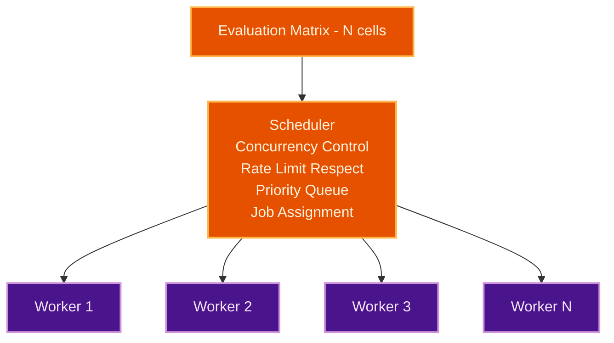
```mermaid
flowchart TD
    classDef sched fill:#e65100,stroke:#ffb74d,stroke-width:2px,color:#fff3e0
    classDef worker fill:#4a148c,stroke:#ce93d8,stroke-width:2px,color:#f3e5f5

    MATRIX["Evaluation Matrix - N cells"]:::sched --> SCHED["Scheduler\nConcurrency Control\nRate Limit Respect\nPriority Queue\nJob Assignment"]:::sched

    SCHED --> W1["Worker 1"]:::worker
    SCHED --> W2["Worker 2"]:::worker
    SCHED --> W3["Worker 3"]:::worker
    SCHED --> WN["Worker N"]:::worker
```

| Responsibility | Why Important |
|---|---|
| Concurrency control | Prevents overwhelming provider APIs |
| Rate limiting | Respects provider rate limits |
| Priority queue | High-priority tests run first |
| Failure isolation | One cell failure does not kill others |
| Progress tracking | Enables live WebSocket updates |

> **Viva Line**: *"The scheduler controls concurrency, execution order and rate limits so that evaluation can scale safely."*

---

## 8. Step 6 — Worker Execution

Each worker independently executes one evaluation cell.

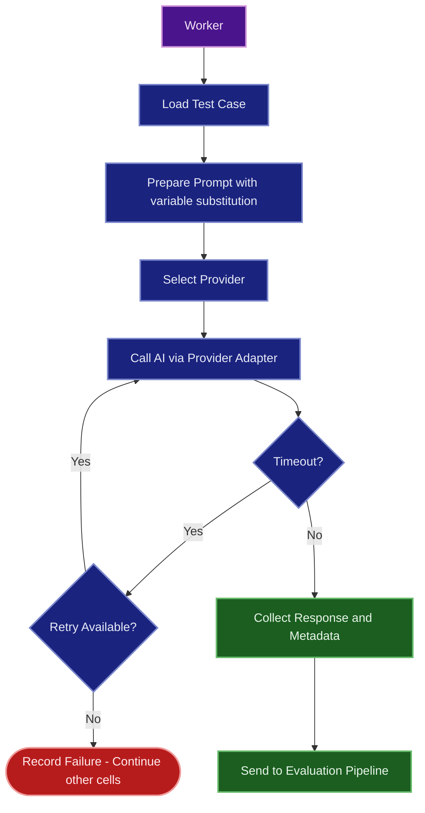
```mermaid
flowchart TD
    classDef worker fill:#4a148c,stroke:#ce93d8,stroke-width:2px,color:#f3e5f5
    classDef step fill:#1a237e,stroke:#7986cb,stroke-width:2px,color:#e8eaf6
    classDef ok fill:#1b5e20,stroke:#66bb6a,stroke-width:2px,color:#e8f5e9
    classDef err fill:#b71c1c,stroke:#ef9a9a,stroke-width:2px,color:#ffebee

    W["Worker"]:::worker --> LOAD["Load Test Case"]:::step
    LOAD --> PREP["Prepare Prompt with variable substitution"]:::step
    PREP --> SEL["Select Provider"]:::step
    SEL --> CALL["Call AI via Provider Adapter"]:::step
    CALL --> TO{Timeout?}:::step
    TO -- Yes --> RETRY{Retry Available?}:::step
    RETRY -- Yes --> CALL
    RETRY -- No --> FAIL(["Record Failure - Continue other cells"]):::err
    TO -- No --> COLLECT["Collect Response and Metadata"]:::ok
    COLLECT --> EVAL["Send to Evaluation Pipeline"]:::ok
```

> **Key Rule**: A failure in one evaluation cell should NOT unnecessarily terminate unrelated cells.

---

## 9. Step 7 — Provider Adapter

ARTEF uses **provider abstraction** so the core evaluation logic stays independent.

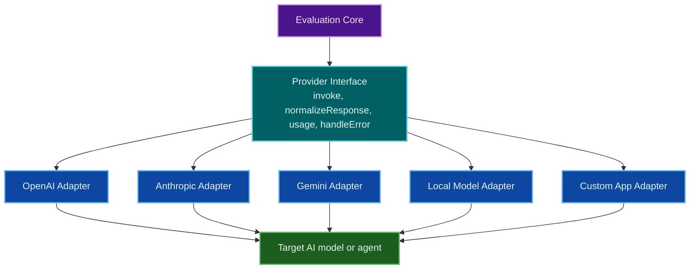
```mermaid
flowchart TD
    classDef core fill:#4a148c,stroke:#ce93d8,stroke-width:2px,color:#f3e5f5
    classDef iface fill:#006064,stroke:#4dd0e1,stroke-width:2px,color:#e0f7fa
    classDef provider fill:#0d47a1,stroke:#64b5f6,stroke-width:2px,color:#e3f2fd
    classDef target fill:#1b5e20,stroke:#66bb6a,stroke-width:2px,color:#e8f5e9

    CORE["Evaluation Core"]:::core --> IFACE["Provider Interface\ninvoke, normalizeResponse, usage, handleError"]:::iface

    IFACE --> OAI["OpenAI Adapter"]:::provider
    IFACE --> ANT["Anthropic Adapter"]:::provider
    IFACE --> GEM["Gemini Adapter"]:::provider
    IFACE --> LOCAL["Local Model Adapter"]:::provider
    IFACE --> CUSTOM["Custom App Adapter"]:::provider

    OAI --> TARGET["Target AI model or agent"]:::target
    ANT --> TARGET
    GEM --> TARGET
    LOCAL --> TARGET
    CUSTOM --> TARGET
```

> **Viva Line**: *"Provider abstraction keeps the evaluation core independent from a specific AI provider."*

---

## 10. Step 8 — Target AI Model / Agent

### Simple LLM:

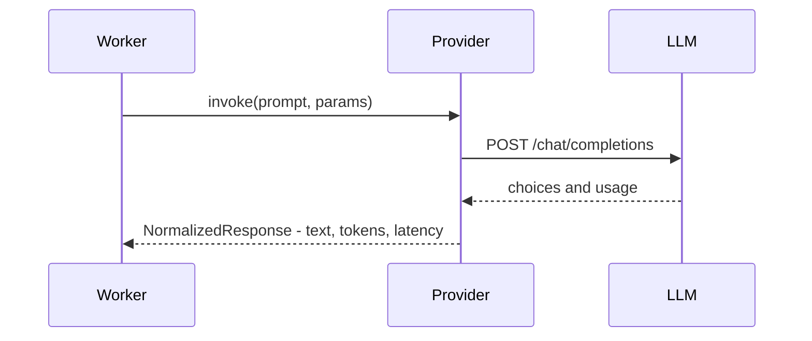
```mermaid
sequenceDiagram
    participant W as Worker
    participant P as Provider
    participant AI as LLM

    W->>P: invoke(prompt, params)
    P->>AI: POST /chat/completions
    AI-->>P: choices and usage
    P-->>W: NormalizedResponse - text, tokens, latency
```

### Complex AI Agent Trajectory:

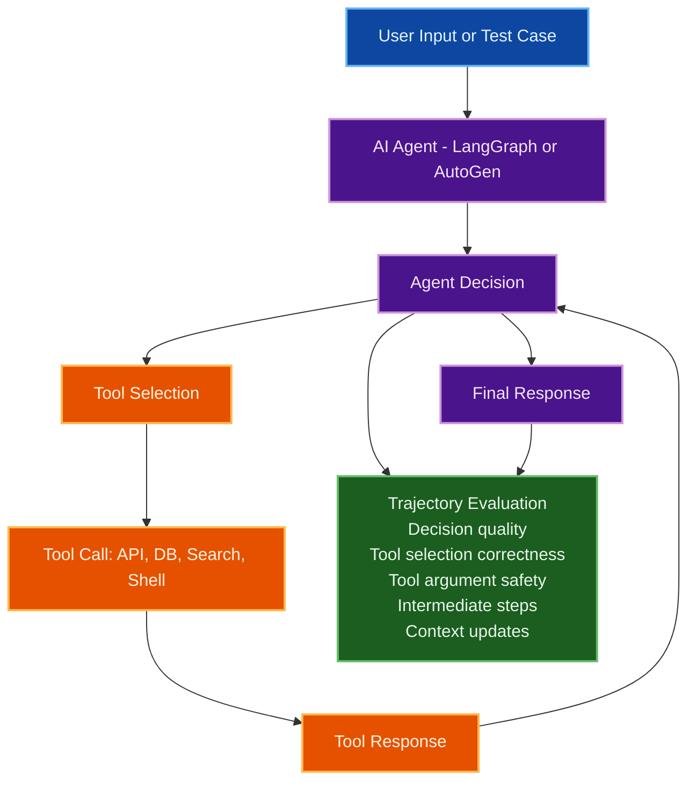
```mermaid
flowchart TD
    classDef input fill:#0d47a1,stroke:#64b5f6,stroke-width:2px,color:#e3f2fd
    classDef agent fill:#4a148c,stroke:#ce93d8,stroke-width:2px,color:#f3e5f5
    classDef tool fill:#e65100,stroke:#ffb74d,stroke-width:2px,color:#fff3e0
    classDef eval fill:#1b5e20,stroke:#66bb6a,stroke-width:2px,color:#e8f5e9

    INPUT["User Input or Test Case"]:::input --> AGENT["AI Agent - LangGraph or AutoGen"]:::agent
    AGENT --> DECISION["Agent Decision"]:::agent
    DECISION --> TOOL_SEL["Tool Selection"]:::tool
    TOOL_SEL --> TOOL_CALL["Tool Call: API, DB, Search, Shell"]:::tool
    TOOL_CALL --> TOOL_RESP["Tool Response"]:::tool
    TOOL_RESP --> DECISION
    DECISION --> FINAL["Final Response"]:::agent

    DECISION --> TRAJ_EVAL["Trajectory Evaluation\nDecision quality\nTool selection correctness\nTool argument safety\nIntermediate steps\nContext updates"]:::eval
    FINAL --> TRAJ_EVAL
```

> **Key Point**: ARTEF evaluates the **complete trajectory**, not only the final answer.

---

## 11. Step 9 — Response Collection

| Metadata Field | Value Example | Purpose |
|---|---|---|
| `response_text` | "Order cancelled successfully." | Actual AI output |
| `model` | `gpt-4o-mini` | Which model answered |
| `provider` | `openai` | Which provider was used |
| `latency_ms` | `1234` | Response time |
| `prompt_tokens` | `145` | Input tokens used |
| `completion_tokens` | `38` | Output tokens used |
| `total_cost_usd` | `0.0002` | Cost of this call |
| `trace_id` | `eval-abc-123` | OpenTelemetry trace link |
| `timestamp` | `2026-09-26T13:00:00Z` | When it was called |
| `config_version` | `v2.1.0` | Config that produced this |

---

## 12. Step 10 — Assertions Engine

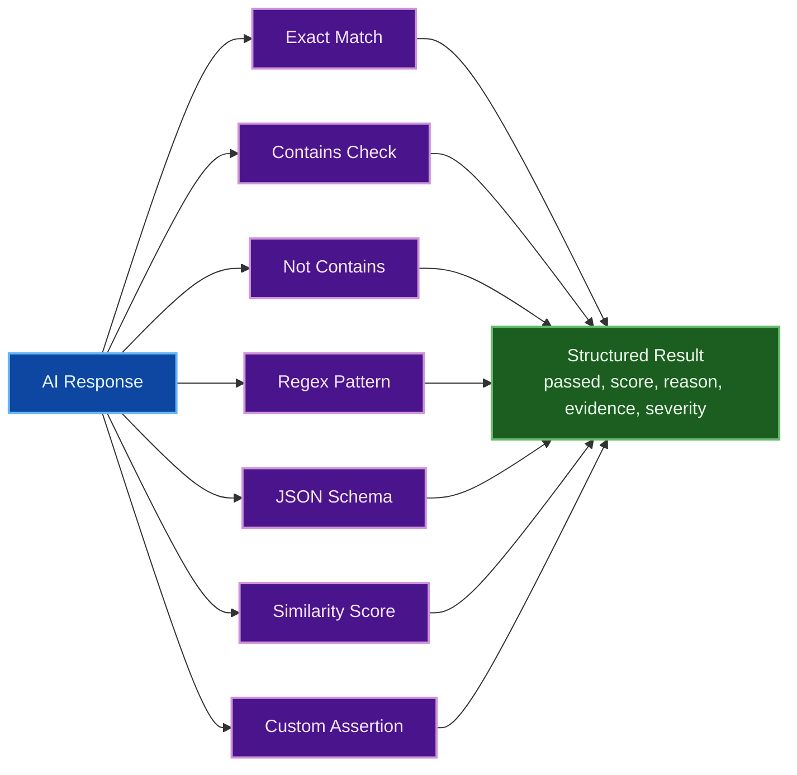
```mermaid
flowchart LR
    classDef resp fill:#0d47a1,stroke:#64b5f6,stroke-width:2px,color:#e3f2fd
    classDef assert fill:#4a148c,stroke:#ce93d8,stroke-width:2px,color:#f3e5f5
    classDef result fill:#1b5e20,stroke:#66bb6a,stroke-width:2px,color:#e8f5e9

    RESP["AI Response"]:::resp --> A1["Exact Match"]:::assert
    RESP --> A2["Contains Check"]:::assert
    RESP --> A3["Not Contains"]:::assert
    RESP --> A4["Regex Pattern"]:::assert
    RESP --> A5["JSON Schema"]:::assert
    RESP --> A6["Similarity Score"]:::assert
    RESP --> A7["Custom Assertion"]:::assert

    A1 --> RES["Structured Result\npassed, score, reason, evidence, severity"]:::result
    A2 --> RES
    A3 --> RES
    A4 --> RES
    A5 --> RES
    A6 --> RES
    A7 --> RES
```

```json
{
  "assertion_type": "contains",
  "passed": true,
  "score": 1.0,
  "reason": "Response contains expected keyword 'cancelled'",
  "evidence": {"expected": "cancelled", "actual_excerpt": "...cancelled successfully..."},
  "severity": "LOW"
}
```

> **Viva Line**: *"Assertions are used for deterministic and rule-based evaluation of AI responses."*

---

## 13. Step 11 — AI Judge

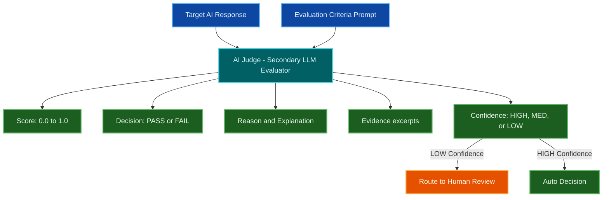
```mermaid
flowchart TD
    classDef input fill:#0d47a1,stroke:#64b5f6,stroke-width:2px,color:#e3f2fd
    classDef judge fill:#006064,stroke:#4dd0e1,stroke-width:2px,color:#e0f7fa
    classDef result fill:#1b5e20,stroke:#66bb6a,stroke-width:2px,color:#e8f5e9
    classDef review fill:#e65100,stroke:#ffb74d,stroke-width:2px,color:#fff3e0

    RESP["Target AI Response"]:::input --> JUDGE["AI Judge - Secondary LLM Evaluator"]:::judge
    PROMPT["Evaluation Criteria Prompt"]:::input --> JUDGE

    JUDGE --> SCORE["Score: 0.0 to 1.0"]:::result
    JUDGE --> DECISION["Decision: PASS or FAIL"]:::result
    JUDGE --> REASON["Reason and Explanation"]:::result
    JUDGE --> EVIDENCE["Evidence excerpts"]:::result
    JUDGE --> CONF["Confidence: HIGH, MED, or LOW"]:::result

    CONF -- LOW Confidence --> HUMAN["Route to Human Review"]:::review
    CONF -- HIGH Confidence --> AUTO["Auto Decision"]:::result
```

> **Important**: Never treat AI Judge output as unquestionable truth. Low-confidence results MUST go to human review.

---

## 14. Step 12 — Red-Team Engine

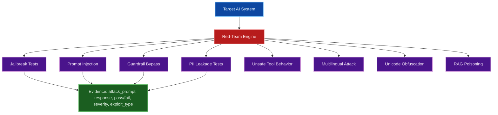
```mermaid
flowchart TD
    classDef target fill:#0d47a1,stroke:#64b5f6,stroke-width:2px,color:#e3f2fd
    classDef redteam fill:#b71c1c,stroke:#ef9a9a,stroke-width:2px,color:#ffebee
    classDef attack fill:#4a148c,stroke:#ce93d8,stroke-width:2px,color:#f3e5f5
    classDef evidence fill:#1b5e20,stroke:#66bb6a,stroke-width:2px,color:#e8f5e9

    TARGET["Target AI System"]:::target --> RT["Red-Team Engine"]:::redteam

    RT --> JB["Jailbreak Tests"]:::attack
    RT --> PI["Prompt Injection"]:::attack
    RT --> GB["Guardrail Bypass"]:::attack
    RT --> PII["PII Leakage Tests"]:::attack
    RT --> TOOL["Unsafe Tool Behavior"]:::attack
    RT --> MULTI["Multilingual Attack"]:::attack
    RT --> UNI["Unicode Obfuscation"]:::attack
    RT --> RAG_ATK["RAG Poisoning"]:::attack

    JB --> EV["Evidence: attack_prompt, response, pass/fail, severity, exploit_type"]:::evidence
    PI --> EV
    GB --> EV
    PII --> EV
```

> **Simple meaning**: *Normal evaluation asks "Does the AI work correctly?" Red-teaming asks "Can we make the AI behave unsafely?"*

---

## 15. Step 13 — Safety & Security Checks

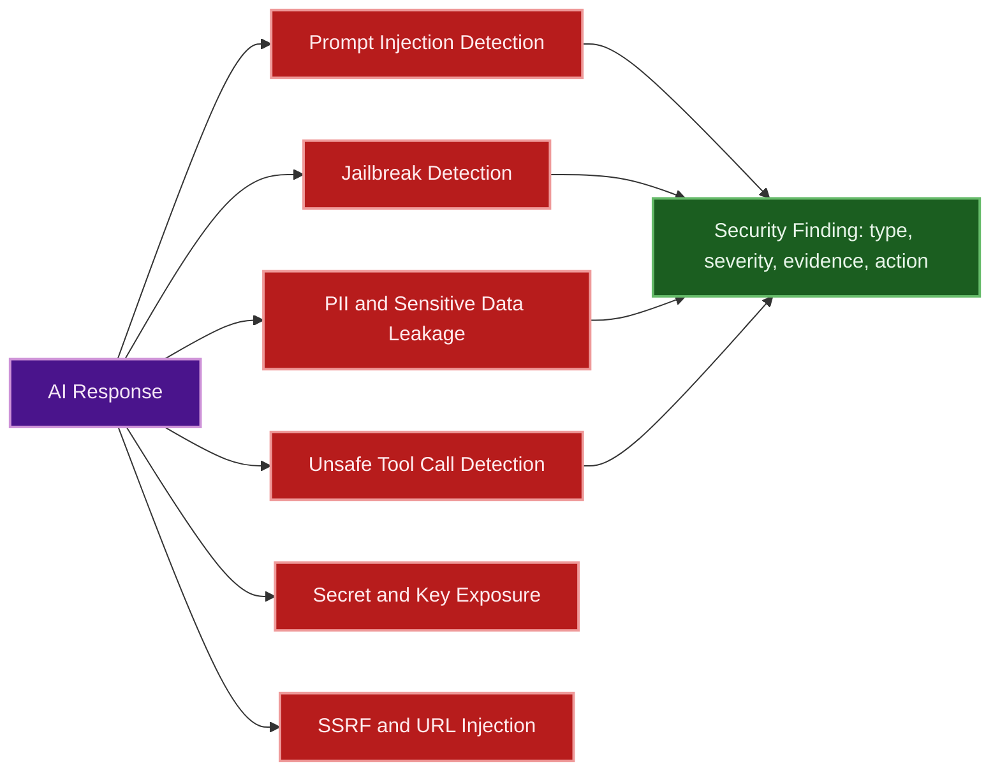
```mermaid
flowchart LR
    classDef check fill:#4a148c,stroke:#ce93d8,stroke-width:2px,color:#f3e5f5
    classDef sec fill:#b71c1c,stroke:#ef9a9a,stroke-width:2px,color:#ffebee
    classDef ok fill:#1b5e20,stroke:#66bb6a,stroke-width:2px,color:#e8f5e9

    RESP["AI Response"]:::check --> PI["Prompt Injection Detection"]:::sec
    RESP --> JB["Jailbreak Detection"]:::sec
    RESP --> PII2["PII and Sensitive Data Leakage"]:::sec
    RESP --> TOOL2["Unsafe Tool Call Detection"]:::sec
    RESP --> SEC_EXP["Secret and Key Exposure"]:::sec
    RESP --> SSRF["SSRF and URL Injection"]:::sec

    PI --> RESULT["Security Finding: type, severity, evidence, action"]:::ok
    JB --> RESULT
    PII2 --> RESULT
    TOOL2 --> RESULT
```

> **Key Distinction**: An answer can be **correct** but still **unsafe**. Both must be checked independently.

---

## 16. Step 14 — Model Security Scanner

| | Red Teaming | Model Scanner |
|---|---|---|
| What it tests | AI **behavior** at runtime | Model **file/artifact** |
| When it runs | During evaluation | During model onboarding |
| Attack type | Prompt-level | File-level (pickle, supply chain) |
| Output | Runtime behavior findings | Static security findings |

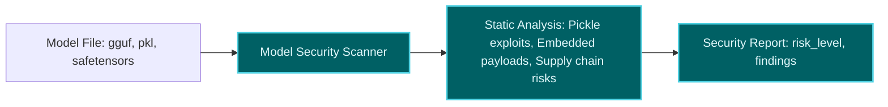
```mermaid
flowchart LR
    classDef scanner fill:#006064,stroke:#4dd0e1,stroke-width:2px,color:#e0f7fa

    FILE["Model File: gguf, pkl, safetensors"] --> SCAN["Model Security Scanner"]:::scanner
    SCAN --> STATIC["Static Analysis: Pickle exploits, Embedded payloads, Supply chain risks"]:::scanner
    STATIC --> REPORT["Security Report: risk_level, findings"]:::scanner
```

---

## 17. Step 15 — Result Aggregation

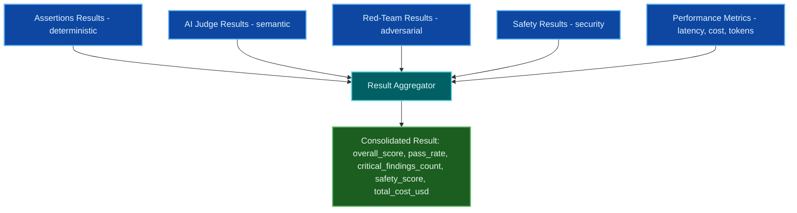
```mermaid
flowchart TD
    classDef input fill:#0d47a1,stroke:#64b5f6,stroke-width:2px,color:#e3f2fd
    classDef agg fill:#006064,stroke:#4dd0e1,stroke-width:2px,color:#e0f7fa
    classDef output fill:#1b5e20,stroke:#66bb6a,stroke-width:2px,color:#e8f5e9

    A["Assertions Results - deterministic"]:::input --> AGG["Result Aggregator"]:::agg
    J["AI Judge Results - semantic"]:::input --> AGG
    R["Red-Team Results - adversarial"]:::input --> AGG
    S["Safety Results - security"]:::input --> AGG
    P["Performance Metrics - latency, cost, tokens"]:::input --> AGG

    AGG --> SUMMARY["Consolidated Result: overall_score, pass_rate, critical_findings_count, safety_score, total_cost_usd"]:::output
```

---

## 18. Step 16 — Evidence & Traceability

> **ARTEF does NOT store only PASSED or FAILED. It stores complete evidence.**

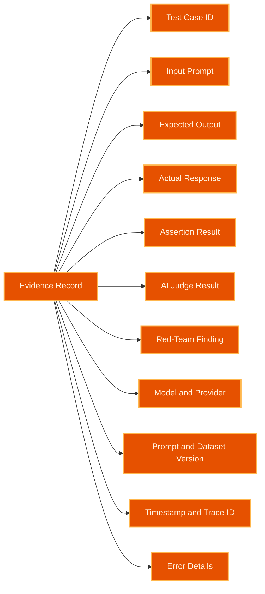
```mermaid
flowchart LR
    classDef store fill:#e65100,stroke:#ffb74d,stroke-width:2px,color:#fff3e0

    EV["Evidence Record"]:::store --> F1["Test Case ID"]:::store
    EV --> F2["Input Prompt"]:::store
    EV --> F3["Expected Output"]:::store
    EV --> F4["Actual Response"]:::store
    EV --> F5["Assertion Result"]:::store
    EV --> F6["AI Judge Result"]:::store
    EV --> F7["Red-Team Finding"]:::store
    EV --> F8["Model and Provider"]:::store
    EV --> F9["Prompt and Dataset Version"]:::store
    EV --> F10["Timestamp and Trace ID"]:::store
    EV --> F11["Error Details"]:::store
```

> **Viva Line**: *"We store complete evidence so developers can understand what failed, why it failed, and under which configuration."*

---

## 19. Step 17 — Database Storage

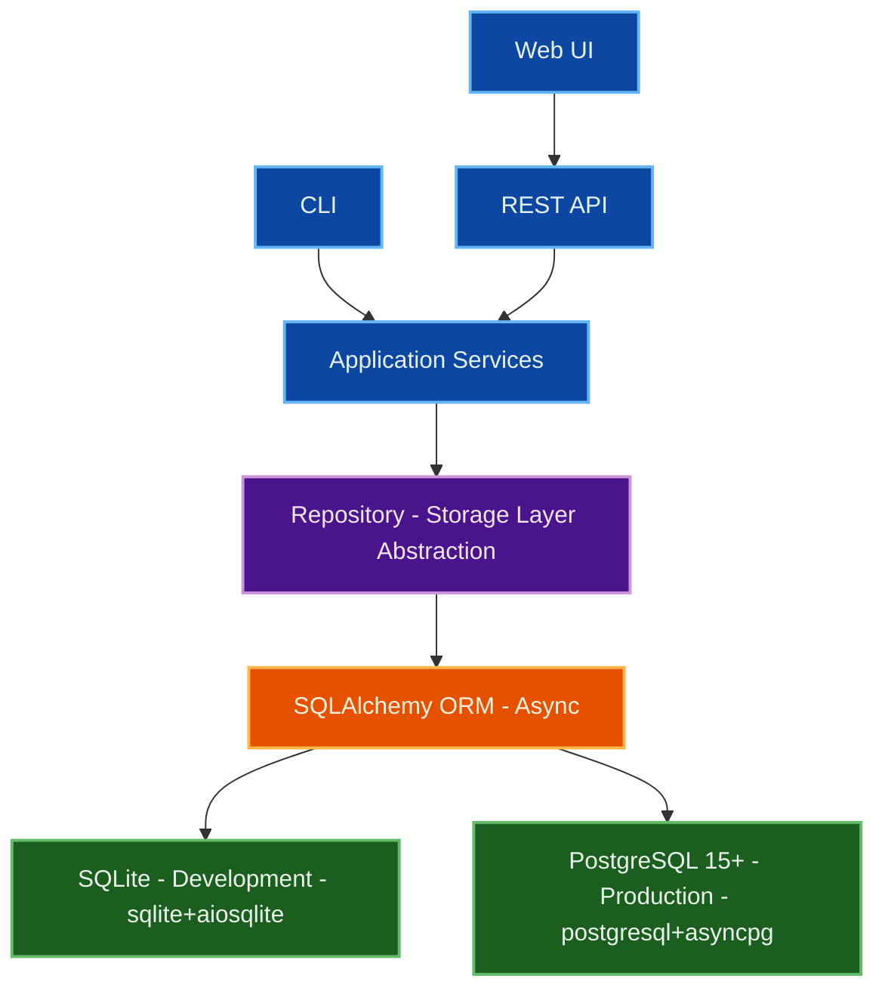
```mermaid
flowchart TD
    classDef app fill:#0d47a1,stroke:#64b5f6,stroke-width:2px,color:#e3f2fd
    classDef repo fill:#4a148c,stroke:#ce93d8,stroke-width:2px,color:#f3e5f5
    classDef orm fill:#e65100,stroke:#ffb74d,stroke-width:2px,color:#fff3e0
    classDef db fill:#1b5e20,stroke:#66bb6a,stroke-width:2px,color:#e8f5e9

    CLI["CLI"]:::app --> CORE
    WEB["Web UI"]:::app --> API["REST API"]:::app
    API --> CORE["Application Services"]:::app
    CORE --> REPO["Repository - Storage Layer Abstraction"]:::repo
    REPO --> ORM["SQLAlchemy ORM - Async"]:::orm

    ORM --> SQLITE["SQLite - Development - sqlite+aiosqlite"]:::db
    ORM --> PG["PostgreSQL 15+ - Production - postgresql+asyncpg"]:::db
```

| | SQLite | PostgreSQL |
|---|---|---|
| **Use Case** | Local Development | Production |
| **Setup** | Zero installation | Docker/managed service |
| **Concurrency** | Single writer | 50+ concurrent workers |
| **JSON support** | Text (monkey-patched) | Native JSONB + GIN index |

---

## 20. Step 18 — Baseline Comparison

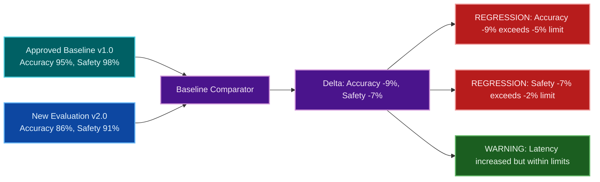
```mermaid
flowchart LR
    classDef base fill:#006064,stroke:#4dd0e1,stroke-width:2px,color:#e0f7fa
    classDef new fill:#0d47a1,stroke:#64b5f6,stroke-width:2px,color:#e3f2fd
    classDef comp fill:#4a148c,stroke:#ce93d8,stroke-width:2px,color:#f3e5f5
    classDef reg fill:#b71c1c,stroke:#ef9a9a,stroke-width:2px,color:#ffebee
    classDef ok fill:#1b5e20,stroke:#66bb6a,stroke-width:2px,color:#e8f5e9

    BASE["Approved Baseline v1.0\nAccuracy 95%, Safety 98%"]:::base --> COMP["Baseline Comparator"]:::comp
    NEW["New Evaluation v2.0\nAccuracy 86%, Safety 91%"]:::new --> COMP

    COMP --> DELTA["Delta: Accuracy -9%, Safety -7%"]:::comp
    DELTA --> R1["REGRESSION: Accuracy -9% exceeds -5% limit"]:::reg
    DELTA --> R2["REGRESSION: Safety -7% exceeds -2% limit"]:::reg
    DELTA --> R3["WARNING: Latency increased but within limits"]:::ok
```

---

## 21. Step 19 — Regression Detection

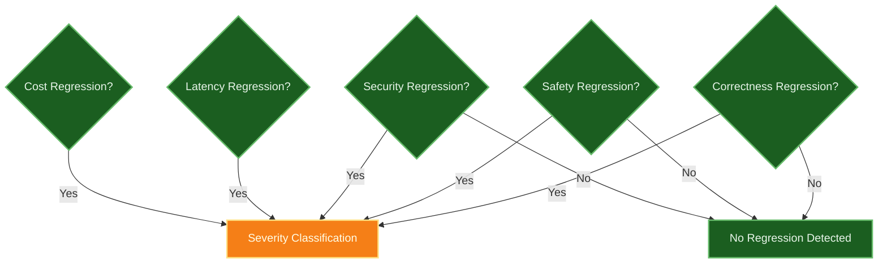
```mermaid
flowchart TD
    classDef ok fill:#1b5e20,stroke:#66bb6a,stroke-width:2px,color:#e8f5e9
    classDef warn fill:#f57f17,stroke:#ffe082,stroke-width:2px,color:#fffde7

    CORR{Correctness Regression?}:::ok -- Yes --> SEV["Severity Classification"]:::warn
    SAFE{Safety Regression?}:::ok -- Yes --> SEV
    SEC{Security Regression?}:::ok -- Yes --> SEV
    LAT{Latency Regression?}:::ok -- Yes --> SEV
    COST{Cost Regression?}:::ok -- Yes --> SEV

    CORR -- No --> PASS["No Regression Detected"]:::ok
    SAFE -- No --> PASS
    SEC -- No --> PASS
```

---

## 22. Step 20 — Severity Classification

| Severity | Meaning | Example |
|---|---|---|
| **LOW** | Minor issue, no risk | Minor formatting difference |
| **MEDIUM** | Functional issue, limited impact | Repeated incorrect answer |
| **HIGH** | Security/safety weakness | Guardrail partial bypass |
| **CRITICAL** | Serious unsafe behavior | Full jailbreak, PII leak |

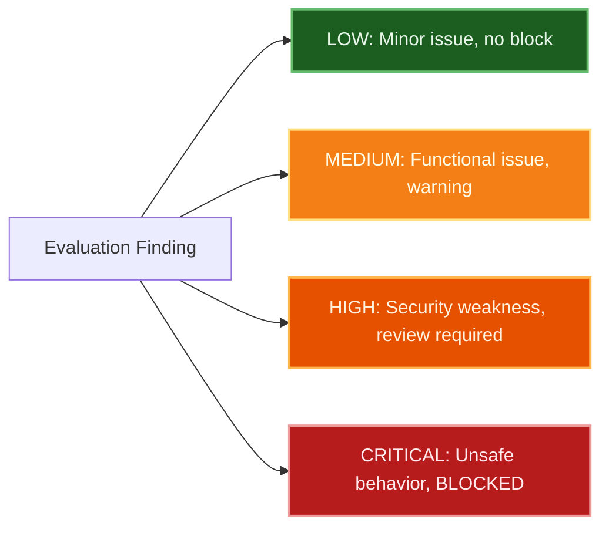
```mermaid
flowchart LR
    classDef low fill:#1b5e20,stroke:#66bb6a,stroke-width:2px,color:#e8f5e9
    classDef med fill:#f57f17,stroke:#ffe082,stroke-width:2px,color:#fffde7
    classDef high fill:#e65100,stroke:#ffb74d,stroke-width:2px,color:#fff3e0
    classDef crit fill:#b71c1c,stroke:#ef9a9a,stroke-width:2px,color:#ffebee

    FINDING["Evaluation Finding"] --> LOW["LOW: Minor issue, no block"]:::low
    FINDING --> MED["MEDIUM: Functional issue, warning"]:::med
    FINDING --> HIGH["HIGH: Security weakness, review required"]:::high
    FINDING --> CRIT["CRITICAL: Unsafe behavior, BLOCKED"]:::crit
```

---

## 23. Step 21 — Threshold Engine

```yaml
thresholds:
  accuracy:
    min: 0.90
    regression_limit: 0.05
  safety:
    min: 0.95
    regression_limit: 0.02
  max_latency_p95_ms: 3000
  critical_findings: 0
  max_total_cost_usd: 10.0
```

```mermaid
flowchart TD
    classDef ok fill:#1b5e20,stroke:#66bb6a,stroke-width:2px,color:#e8f5e9
    classDef block fill:#b71c1c,stroke:#ef9a9a,stroke-width:2px,color:#ffebee

    ACTUAL["Actual: Accuracy 88%, Safety 96%, Latency 2.1s, Critical 0"] --> T1{Accuracy >=90%?}
    T1 -- No, 88% < 90% --> BLOCK1["THRESHOLD VIOLATION: Accuracy below minimum"]:::block
    T1 -- Yes --> OK1["Accuracy OK"]:::ok
    BLOCK1 --> GATE["Quality Gate: BLOCKED"]:::block
```

---

## 24. Step 22 — Human Review Queue

```mermaid
flowchart TD
    classDef trigger fill:#4a148c,stroke:#ce93d8,stroke-width:2px,color:#f3e5f5
    classDef queue fill:#006064,stroke:#4dd0e1,stroke-width:2px,color:#e0f7fa
    classDef decision fill:#1b5e20,stroke:#66bb6a,stroke-width:2px,color:#e8f5e9
    classDef block fill:#b71c1c,stroke:#ef9a9a,stroke-width:2px,color:#ffebee

    LC["Low Confidence AI Judge Result"]:::trigger --> Q["Human Review Queue"]:::queue
    AMB["Ambiguous Result"]:::trigger --> Q
    CRIT["Critical Finding"]:::trigger --> Q
    CONF["Configured Policy"]:::trigger --> Q

    Q --> REVIEWER["Human Reviewer: Safety or ML Engineer"]:::queue
    REVIEWER --> APPROVE["Approve - Confirm Pass"]:::decision
    REVIEWER --> OVERRIDE["Override - Mark Acceptable"]:::decision
    REVIEWER --> BLOCK["Escalate - Block Release"]:::block
    REVIEWER --> RETEST["Request Retest"]:::queue

    APPROVE --> FINAL["Final Release Decision"]:::decision
    OVERRIDE --> FINAL
    BLOCK --> FINAL
    RETEST --> FINAL
```

---

## 25. Step 23 — Release Readiness

```mermaid
flowchart TD
    classDef input fill:#0d47a1,stroke:#64b5f6,stroke-width:2px,color:#e3f2fd
    classDef engine fill:#4a148c,stroke:#ce93d8,stroke-width:2px,color:#f3e5f5
    classDef ready fill:#1b5e20,stroke:#66bb6a,stroke-width:2px,color:#e8f5e9
    classDef warn fill:#f57f17,stroke:#ffe082,stroke-width:2px,color:#fffde7
    classDef review fill:#e65100,stroke:#ffb74d,stroke-width:2px,color:#fff3e0
    classDef block fill:#b71c1c,stroke:#ef9a9a,stroke-width:2px,color:#ffebee

    E["Eval Results"]:::input --> REL["Release Readiness Engine"]:::engine
    R["Regression Status"]:::input --> REL
    S["Safety Score"]:::input --> REL
    SEC["Security Findings"]:::input --> REL
    T["Threshold Check"]:::input --> REL
    H["Human Review Decision"]:::input --> REL

    REL --> READY["READY: All criteria met, safe to deploy"]:::ready
    REL --> WARN["READY WITH WARNING: Minor issues, monitor"]:::warn
    REL --> NEEDS["NEEDS REVIEW: Ambiguous, human decision required"]:::review
    REL --> BLOCK["BLOCKED: Critical failure, do not deploy"]:::block
```

---

## 26. Step 24 — Reporting

| Format | Audience | Use Case |
|---|---|---|
| `JSON` | CI/CD pipelines | Machine-readable results |
| `JUnit XML` | GitHub Actions | Test result visualization |
| `HTML` | Developers / Managers | Visual evaluation report |
| `CLI Table` | Terminal users | Quick human-readable summary |
| `Web Dashboard` | Safety/ML teams | Interactive drill-down |

```
artef eval run config.yaml

ARTEF Evaluation Complete
-------------------------------------------
  Total Test Cases:     248
  Passed:               231  (93.1%)
  Failed:                12  (4.8%)
  Red-Team Attacks:      45  => 3 succeeded (6.7% bypass rate)
  Critical Findings:      0
  Safety Score:         96.2%
  Latency P95:           1.8s
  Total Cost:           $0.34
  Regression vs v1.0:   -1.9% accuracy (within limits)

Release Status: READY WITH WARNING
Exit code: 0
```

---

## 27. Step 25 — CI/CD Quality Gate

```mermaid
flowchart TD
    classDef ci fill:#0d47a1,stroke:#64b5f6,stroke-width:2px,color:#e3f2fd
    classDef eval fill:#4a148c,stroke:#ce93d8,stroke-width:2px,color:#f3e5f5
    classDef pass fill:#1b5e20,stroke:#66bb6a,stroke-width:3px,color:#e8f5e9
    classDef fail fill:#b71c1c,stroke:#ef9a9a,stroke-width:3px,color:#ffebee

    PUSH["Developer Push: git push origin main"]:::ci --> CICD["GitHub Actions CI Pipeline"]:::ci
    CICD --> ARTEF["ARTEF Evaluation: artef eval run ci-config.yaml"]:::eval
    ARTEF --> THRESH["Threshold and Release Policy Check"]:::eval
    THRESH --> GATE{"Quality Gate Decision"}:::eval

    GATE -- All criteria met --> EXIT0["Exit Code 0 - CI PASSES"]:::pass
    EXIT0 --> DEPLOY["Continue Pipeline: Deploy to Production"]:::pass

    GATE -- Criteria violated --> EXIT1["Exit Code 1 - CI FAILS"]:::fail
    EXIT1 --> BLOCK["Pipeline BLOCKED: Release prevented, Team notified"]:::fail
```

> **Machine-readable contract**: Exit Code 0 = pass, Exit Code 1 = blocked

---

## 28. Complete Data Flow Diagram

```mermaid
flowchart LR
    classDef client fill:#1e3a5f,stroke:#4fc3f7,stroke-width:2px,color:#e3f2fd
    classDef core fill:#4a148c,stroke:#ce93d8,stroke-width:2px,color:#f3e5f5
    classDef ai fill:#006064,stroke:#4dd0e1,stroke-width:2px,color:#e0f7fa
    classDef store fill:#e65100,stroke:#ffb74d,stroke-width:2px,color:#fff3e0
    classDef decision fill:#1b5e20,stroke:#66bb6a,stroke-width:2px,color:#e8f5e9

    U["Developer or CI"]:::client --> I["Config Ingestion and Validation"]:::core
    I --> S["Scheduler"]:::core
    S --> P["Provider Router"]:::core
    P --> L["External or Local AI"]:::ai
    L --> P
    P --> G["Assertion and Grader Engine"]:::ai
    G --> R["Result Aggregator"]:::core
    R --> DB["SQLAlchemy ORM - SQLite or PostgreSQL"]:::store
    R --> T["OpenTelemetry Tracing"]:::store
    R --> B["Baseline and Regression Engine"]:::decision
    B --> Q["Quality Gate"]:::decision
    Q --> O["CLI or Web or JSON or JUnit"]:::client
```

---

## 29. Full System Architecture

```mermaid
flowchart TB
    classDef client fill:#1e3a5f,stroke:#4fc3f7,stroke-width:2px,color:#e3f2fd
    classDef api fill:#4a148c,stroke:#ce93d8,stroke-width:2px,color:#f3e5f5
    classDef core fill:#006064,stroke:#4dd0e1,stroke-width:2px,color:#e0f7fa
    classDef ai fill:#1b5e20,stroke:#66bb6a,stroke-width:2px,color:#e8f5e9
    classDef store fill:#e65100,stroke:#ffb74d,stroke-width:2px,color:#fff3e0
    classDef obs fill:#f57f17,stroke:#ffe082,stroke-width:2px,color:#fffde7

    subgraph CLIENT["CLIENT LAYER"]
        CLI["CLI: artef eval run"]:::client
        WEB["Web Dashboard: localhost:3000"]:::client
        SDK["Node.js and TS SDK"]:::client
        CICD["GitHub Actions"]:::client
    end

    subgraph APILAYER["APPLICATION AND API LAYER"]
        REST["REST API: localhost:8000/api/v1"]:::api
        WS["WebSocket: Live Updates"]:::api
        SERVICES["Application Services"]:::api
    end

    subgraph CORE["ARTEF EVALUATION CORE"]
        CONFIG["Config Loader and Validator"]:::core
        MATRIX["Matrix Synthesizer"]:::core
        SCHED["Scheduler"]:::core
        WORKER["Evaluation Workers"]:::core
        AGG["Result Aggregator"]:::core
        BASE["Baseline Comparator"]:::core
        REG["Regression Detector"]:::core
        THRESH["Threshold Engine"]:::core
    end

    subgraph AIEVAL["AI AND EVALUATION ENGINES"]
        PROVIDER["Provider Adapters"]:::ai
        ASSERT["Assertions Engine"]:::ai
        JUDGE["AI Judge"]:::ai
        RED["Red-Team Engine"]:::ai
        SCAN["Model Security Scanner"]:::ai
    end

    subgraph STORAGE["PERSISTENCE LAYER"]
        REPO["Repository and Storage Layer"]:::store
        ORM["SQLAlchemy ORM"]:::store
        DB["SQLite dev and PostgreSQL prod"]:::store
    end

    subgraph OBS["OBSERVABILITY"]
        OTEL["OpenTelemetry Tracing"]:::obs
        REPORT["Reporting Engine"]:::obs
    end

    CLI --> CONFIG
    WEB --> REST
    SDK --> REST
    CICD --> CLI
    REST --> SERVICES
    WS --> SERVICES
    SERVICES --> CONFIG
    CONFIG --> MATRIX
    MATRIX --> SCHED
    SCHED --> WORKER
    WORKER --> PROVIDER
    WORKER --> RED
    PROVIDER --> ASSERT
    PROVIDER --> JUDGE
    WORKER --> SCAN
    ASSERT --> AGG
    JUDGE --> AGG
    RED --> AGG
    SCAN --> AGG
    AGG --> BASE
    BASE --> REG
    REG --> THRESH
    AGG --> REPO
    BASE --> REPO
    REPO --> ORM
    ORM --> DB
    WORKER --> OTEL
    AGG --> REPORT
```

---

## 30. API Flow Sequence

```mermaid
sequenceDiagram
    participant UI as React Web UI
    participant API as REST API
    participant AUTH as Auth Middleware
    participant SVC as App Service
    participant CORE as Evaluation Core
    participant AI as AI Provider
    participant DB as SQLite or PostgreSQL

    UI->>API: POST /api/v1/auth/login
    API->>AUTH: Verify credentials
    AUTH-->>UI: JWT Access Token RS256

    UI->>API: POST /api/v1/runs with Bearer token
    API->>AUTH: Validate JWT
    AUTH-->>API: User authorized
    API->>SVC: Create evaluation run
    SVC->>CORE: Start evaluation workflow
    CORE->>AI: Provider invoke prompt and model
    AI-->>CORE: AI Response and usage
    CORE->>DB: Store result and evidence
    CORE-->>SVC: Evaluation result
    SVC-->>API: Run status and results
    API-->>UI: 200 OK with JSON result

    Note over UI,DB: Live progress via WebSocket
    UI->>API: WS Connect /ws/runs/run-id
    CORE-->>API: Progress event: cell 5 of 248 complete
    API-->>UI: WS Message: progress 2.0%, status running
```

---

## 31. Database Flow

```mermaid
flowchart TD
    classDef ui fill:#0d47a1,stroke:#64b5f6,stroke-width:2px,color:#e3f2fd
    classDef api fill:#4a148c,stroke:#ce93d8,stroke-width:2px,color:#f3e5f5
    classDef repo fill:#e65100,stroke:#ffb74d,stroke-width:2px,color:#fff3e0
    classDef db fill:#1b5e20,stroke:#66bb6a,stroke-width:2px,color:#e8f5e9

    WEB["Web UI - Never direct DB access"]:::ui --> API["REST API"]:::api
    CLI["CLI"]:::ui --> CORE["App Services"]:::api
    API --> CORE
    CORE --> REPO["Repository Layer - Abstraction"]:::repo
    REPO --> ORM["SQLAlchemy ORM - Async"]:::repo
    ORM --> SQLITE["SQLite: Development"]:::db
    ORM --> PG["PostgreSQL: Production"]:::db
    SQLITE --> TABLES["Tables: evaluations, test_cases, results, baselines, regressions, traces"]:::db
    PG --> TABLES
```

**Architecture Rule**: UI must NEVER access DB directly. Always: `UI -> API -> Service -> Repository -> DB`

---

## 32. RAG Evaluation Flow

```mermaid
flowchart TD
    classDef input fill:#0d47a1,stroke:#64b5f6,stroke-width:2px,color:#e3f2fd
    classDef retrieval fill:#4a148c,stroke:#ce93d8,stroke-width:2px,color:#f3e5f5
    classDef gen fill:#006064,stroke:#4dd0e1,stroke-width:2px,color:#e0f7fa
    classDef eval fill:#1b5e20,stroke:#66bb6a,stroke-width:2px,color:#e8f5e9
    classDef final fill:#e65100,stroke:#ffb74d,stroke-width:2px,color:#fff3e0

    Q["User Question"]:::input --> RET["Retriever - Vector DB or BM25"]:::retrieval
    RET --> DOCS["Retrieved Documents"]:::retrieval
    DOCS --> CTX["Context Window"]:::retrieval
    CTX --> LLM["LLM Generator"]:::gen
    LLM --> ANS["Final Answer"]:::gen

    DOCS --> REVAL["RETRIEVAL EVALUATION:\nRelevance, Completeness,\nCorrectness, Latency"]:::eval
    CTX --> CEVAL["CONTEXT EVALUATION:\nQuality, Coverage"]:::eval
    ANS --> GEVAL["GENERATION EVALUATION:\nCorrectness, Faithfulness,\nGroundedness, Hallucination,\nPII Leakage"]:::eval

    REVAL --> FINAL["Final RAG Evaluation:\nSeparate retrieval + generation scores"]:::final
    CEVAL --> FINAL
    GEVAL --> FINAL
```

> **Key**: Do NOT mix retrieval failure and generation failure. Diagnose them separately.

---

## 33. AI Agent Evaluation Flow

```mermaid
flowchart TD
    classDef input fill:#0d47a1,stroke:#64b5f6,stroke-width:2px,color:#e3f2fd
    classDef agent fill:#4a148c,stroke:#ce93d8,stroke-width:2px,color:#f3e5f5
    classDef tool fill:#e65100,stroke:#ffb74d,stroke-width:2px,color:#fff3e0
    classDef eval fill:#1b5e20,stroke:#66bb6a,stroke-width:2px,color:#e8f5e9
    classDef unsafe fill:#b71c1c,stroke:#ef9a9a,stroke-width:2px,color:#ffebee

    INPUT["Test Case: Cancel order 12345"]:::input --> AGENT["AI Agent"]:::agent
    AGENT --> D1["Decision: Lookup order first"]:::agent
    D1 --> T1["Tool Call: lookup_order(12345)"]:::tool
    T1 --> R1["Tool Response: status active"]:::tool
    R1 --> D2["Decision: OK to cancel"]:::agent
    D2 --> T2["Tool Call: cancel_order(12345)"]:::tool
    T2 --> R2["Tool Response: cancelled true"]:::tool
    R2 --> FINAL["Final Response: Order cancelled"]:::agent

    D1 --> TRAJ["TRAJECTORY EVALUATION:\nDecision Quality\nTool Selection\nTool Arguments\nUnsafe Tool Check\nFinal Response Quality"]:::eval
    T1 --> TRAJ
    D2 --> TRAJ
    T2 --> TRAJ
    FINAL --> TRAJ

    T2 -. "What if agent tried?" .-> UNSAFE["UNSAFE: delete_all_orders\nCRITICAL FINDING"]:::unsafe
```

---

## 34. Failure Handling Scenarios

### Provider Failure with Bounded Retry

```mermaid
flowchart TD
    classDef ok fill:#1b5e20,stroke:#66bb6a,stroke-width:2px,color:#e8f5e9
    classDef err fill:#b71c1c,stroke:#ef9a9a,stroke-width:2px,color:#ffebee
    classDef warn fill:#f57f17,stroke:#ffe082,stroke-width:2px,color:#fffde7

    WORKER["Worker"] --> PROVIDER["Provider API Call"]
    PROVIDER --> TIMEOUT{Timeout or Error?}
    TIMEOUT -- Yes --> RETRY1["Retry 1/3 exponential backoff"]:::warn
    RETRY1 --> TIMEOUT
    TIMEOUT -- Success --> COLLECT["Collect Response"]:::ok
    TIMEOUT -- 3 retries done --> FAIL["Record Failure: provider_timeout\nContinue other cells"]:::err
```

### One Test Fails — Others Continue

```mermaid
flowchart LR
    classDef ok fill:#1b5e20,stroke:#66bb6a,stroke-width:2px,color:#e8f5e9
    classDef err fill:#b71c1c,stroke:#ef9a9a,stroke-width:2px,color:#ffebee
    classDef agg fill:#006064,stroke:#4dd0e1,stroke-width:2px,color:#e0f7fa

    M["Matrix 4 cells"] --> C1["Cell 1: Pass"]:::ok
    M --> C2["Cell 2: Failed"]:::err
    M --> C3["Cell 3: Pass"]:::ok
    M --> C4["Cell 4: Pass"]:::ok

    C1 --> R["Aggregator"]:::agg
    C2 --> R
    C3 --> R
    C4 --> R

    R --> OVERALL["Overall: 3 passed, 1 failed with evidence stored"]:::agg
```

---

## 35. Security Model

```mermaid
flowchart TD
    classDef protect fill:#b71c1c,stroke:#ef9a9a,stroke-width:2px,color:#ffebee
    classDef ok fill:#1b5e20,stroke:#66bb6a,stroke-width:2px,color:#e8f5e9

    SECRETS["Secrets to Protect:\nAPI Keys, JWT Tokens, Passwords,\nDB Credentials, PII"]:::protect

    SECRETS -. "NEVER appear in" .-> LOG["Application Logs"]:::protect
    SECRETS -. "NEVER appear in" .-> RESP["API Responses"]:::protect
    SECRETS -. "NEVER appear in" .-> TRACE["OpenTelemetry Traces"]:::protect
    SECRETS -. "NEVER appear in" .-> REPORT["Evaluation Reports"]:::protect
    SECRETS -. "NEVER appear in" .-> DB["Database Records"]:::protect

    ENV["Store in: .env gitignored\nEnvironment Variables\nSecrets Manager in prod"]:::ok
```

| Control | Implementation |
|---|---|
| Authentication | RS256 JWT tokens |
| Authorization | Role-based: admin, safety_eng, ml_eng, reviewer, viewer |
| Rate Limiting | Sliding window per user/IP |
| CORS | Configured whitelist |
| Input Validation | Pydantic schemas on all endpoints |

---

## 36. Architecture Rules

```mermaid
flowchart TD
    classDef allowed fill:#1b5e20,stroke:#66bb6a,stroke-width:2px,color:#e8f5e9
    classDef forbidden fill:#b71c1c,stroke:#ef9a9a,stroke-width:2px,color:#ffebee

    subgraph CORRECT["CORRECT ARCHITECTURE"]
        A1["UI -> API -> Service -> Repository -> DB"]:::allowed
        A2["Provider Interface -> Specific Adapter"]:::allowed
    end

    subgraph FORBIDDEN["FORBIDDEN PATTERNS"]
        F1["UI accessing DB directly"]:::forbidden
        F2["UI calling Provider API directly"]:::forbidden
        F3["API Handler with huge business logic"]:::forbidden
        F4["Core tightly coupled to SQLite"]:::forbidden
    end
```

**The 15 Architecture Rules:**

| # | Rule |
|---|---|
| 1 | UI must NOT directly access database |
| 2 | UI must NOT directly call provider internals |
| 3 | API handlers must remain thin |
| 4 | CLI and SDK must NOT duplicate business logic |
| 5 | Evaluation Core must NOT depend on UI |
| 6 | Evaluation Core should NOT be tightly coupled to SQLite |
| 7 | Providers must use abstraction interfaces |
| 8 | Assertions must be independent of UI |
| 9 | Red-team functionality must use plugin contracts |
| 10 | AI Judge must be replaceable |
| 11 | Model scanning must be isolated from inference |
| 12 | Secrets must remain protected everywhere |
| 13 | Historical results must remain reproducible |
| 14 | Long-running evaluation must use scheduler and worker architecture |
| 15 | CI output must be deterministic and machine-readable |

---

## 37. Master Audit Prompt

```
You are a senior staff-level software engineer, AI evaluation engineer,
QA engineer, security engineer, and production architect.

PROJECT: ARTEF - Agent Red-Teaming and Evaluation Framework

GOAL: Make the existing ARTEF repository production-ready.

IMPORTANT RULES:
- Do NOT blindly rewrite the project
- Do NOT remove working functionality
- Do NOT create fake implementations
- Fix ROOT CAUSE, not symptoms

PHASE ORDER:
1. UNDERSTAND - Read complete repo all files
2. PRD GAP - Compare repo against PRD
3. BUILD - Run: install, typecheck, lint, build, test
4. GITHUB CI - Fix ALL failing GitHub Actions tests
5. DATABASE - Audit schema, migrations, queries
6. API - Audit routes, validation, error handling, auth
7. EVALUATION ENGINE - Verify complete workflow
8. PROVIDER ABSTRACTION - Ensure interface-based providers
9. ASSERTIONS - Verify all assertion types
10. AI JUDGE - Implement with replaceable interface
11. RED TEAMING - Verify all attack plugins
12. AGENT EVALUATION - Verify trajectory not just answer
13. RAG EVALUATION - Verify retrieval and generation separately
14. BASELINE AND REGRESSION - Verify historical comparison
15. RELEASE READINESS - Verify READY/WARNING/REVIEW/BLOCKED
16. SECURITY AUDIT - Check secrets, injection, auth, CORS
17. ERROR HANDLING - Bounded retries, timeouts, isolation
18. OBSERVABILITY - OpenTelemetry no secrets in traces
19. CLI/SDK/UI - Same core logic no duplication
20. TEST COVERAGE - All 11 test categories
21. GITHUB CI/CD - Reliable with correct exit codes
22. CODE QUALITY - Fix dead code, types, coupling
23. ARCHITECTURE RULES - Enforce all 15 rules
24. FINAL VERIFICATION - Run complete suite again
```

---

## 38. Viva & Interview Answers

### Q1: What is ARTEF?
> *"ARTEF stands for Agent Red-Teaming and Evaluation Framework. It is a framework for continuous evaluation and security testing of AI agents and AI-powered applications. It checks if a new AI version is still correct, safe, secure, reliable, and within performance thresholds before deployment."*

### Q2: What is the complete workflow?
> *"Configuration -> Validation -> Matrix -> Scheduler -> Provider -> Response -> Assertions + AI Judge + Red Team + Safety -> Aggregation -> Evidence Storage -> Baseline Comparison -> Regression Detection -> Severity -> Threshold -> Human Review -> Release Readiness -> CI/CD Gate -> Report."*

### Q3: Why baseline comparison?
> *"To compare a new AI version against a previously approved result and detect regressions. Without historical data, we cannot know if version 2.0 is worse than version 1.0."*

### Q4: Why red-teaming?
> *"Normal evaluation asks 'does the AI work correctly?' Red-teaming asks 'can we make the AI behave incorrectly or unsafely?' It intentionally attacks the AI to find jailbreaks, prompt injections, and guardrail bypasses before a real attacker finds them."*

### Q5: Why AI Judge?
> *"For semantic and subjective qualities like helpfulness, relevance, tone, and faithfulness that fixed deterministic assertions cannot reliably evaluate."*

### Q6: Why provider abstraction?
> *"To keep the evaluation core independent from a specific AI provider. Switching from OpenAI to Anthropic requires only adding a new adapter, not changing core logic."*

### Q7: What happens when a test case fails?
> *"The failure is captured with complete evidence, stored in the database, and included in result aggregation. The final release decision depends on severity, thresholds, and configured policy."*

### Q8: What is the difference between Red Teaming and Model Scanner?
> *"Red Teaming tests AI behavior at runtime using adversarial prompts. The Model Scanner tests the model artifact file statically, checking for pickle exploits and supply chain risks."*

### Q9: Why database?
> *"To persist evaluation results, historical runs, baselines, traces, and evidence. Without historical data, regression detection is impossible."*

### Q10: How does CI/CD integration work?
> *"ARTEF runs as part of GitHub Actions. If the quality gate passes, it exits with code 0 and the pipeline continues. If it fails, it exits with code 1 and the pipeline is blocked, preventing unsafe AI deployments."*

---

## 39. One-Line Memory Trick

```
ARTEF = TEST => ATTACK => COMPARE => INVESTIGATE => RELEASE
```

| Stage | What Happens |
|---|---|
| **TEST** | Correctness and quality evaluation |
| **ATTACK** | Red-team and security testing |
| **COMPARE** | Baseline and regression detection |
| **INVESTIGATE** | Evidence, traces, severity, human review |
| **RELEASE** | Quality gate and release readiness decision |

### Complete 15-Word Workflow Summary

```
Request -> Config -> Validate -> Matrix -> Schedule -> Execute ->
Evaluate -> Attack -> Aggregate -> Store -> Compare ->
Detect -> Review -> Decide -> Release
```

### Final Memory Diagram

```
                    ARTEF
                      |
             What should we test?
                      |
                 CONFIGURE
                      |
              Is config valid?
                      |
                 VALIDATE
                      |
              What combinations?
                      |
                  MATRIX
                      |
              How to execute?
                      |
                 SCHEDULE
                      |
              Call target AI
                      |
                 EXECUTE
                      |
         +------+-----+------+
         |      |     |      |
     ASSERT   JUDGE  RED   SAFETY
         |      |     |      |
         +------+-----+------+
                      |
                  AGGREGATE
                      |
                 STORE EVIDENCE
                      |
             COMPARE BASELINE
                      |
             DETECT REGRESSION
                      |
             SEVERITY + THRESHOLD
                      |
              HUMAN REVIEW?
                 /         \
              YES           NO
               |             |
             REVIEW      AUTO DECISION
                 \           /
                  RELEASE
                      |
          READY / WARNING / REVIEW / BLOCKED
```

---

*Generated for: ARTEF - Agent Red-Teaming & Evaluation Framework*
*Document covers: Complete end-to-end workflow, all 25 steps, 20+ Mermaid diagrams, viva Q&A, master audit prompt*
*Version: 2.0.0 Production Edition*
