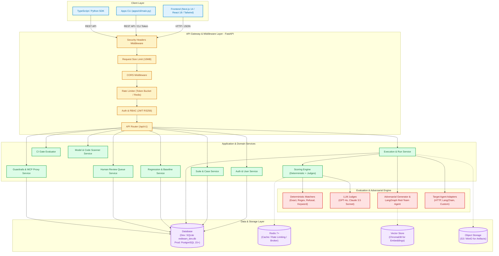
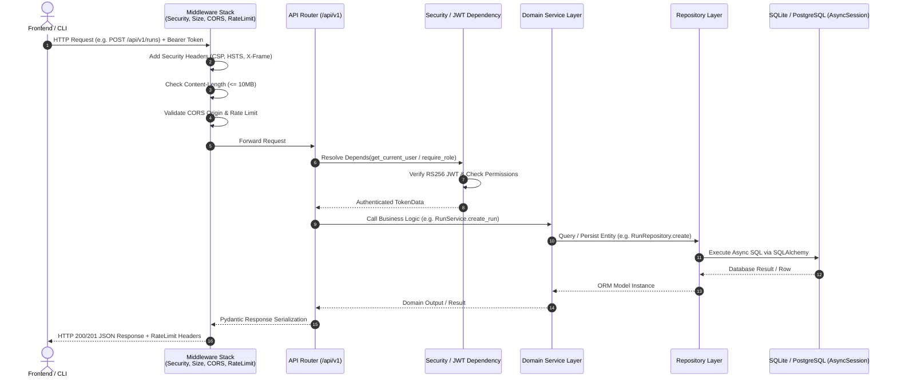
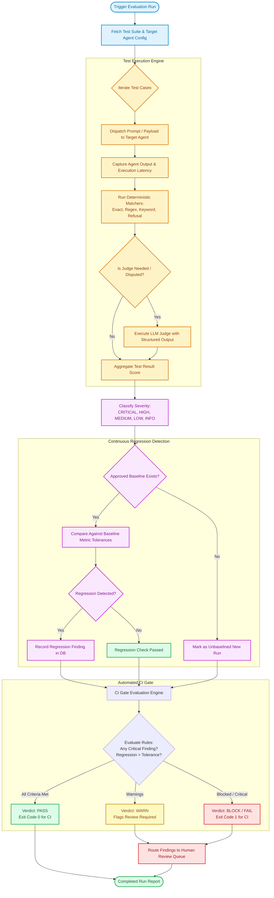
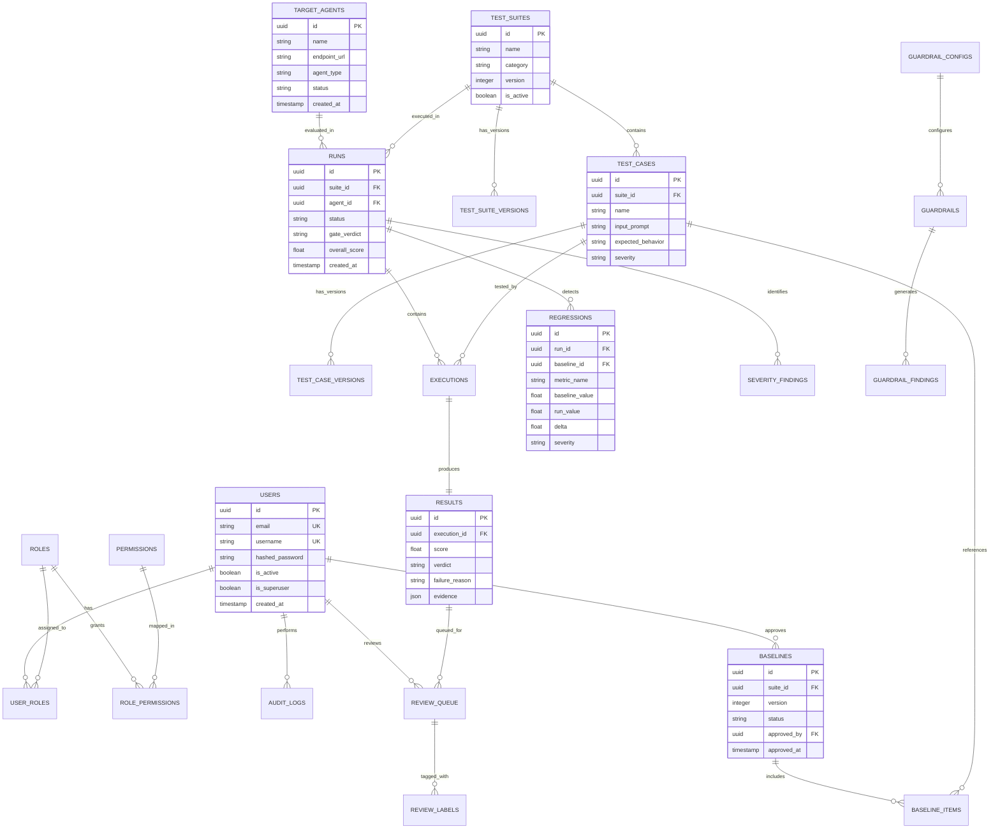

# Agent Red-Teaming & Evaluation Framework: Master Architecture & Project Guide

A continuous-assurance platform that evaluates AI/LLM agents against deterministic and adversarial test cases, detects safety/behavioral regressions against approved historical baselines, classifies severity, produces evidence-rich reports, routes uncertain findings to human reviewers, and provides a deterministic CI gate capable of blocking a merge/deployment.

---

## Table of Contents

1. [System Overview & Key Capabilities](#1-system-overview--key-capabilities)
2. [End-to-End System Architecture](#2-end-to-end-system-architecture)
3. [How to Run the Project (Step-by-Step)](#3-how-to-run-the-project-step-by-step)
   - [Prerequisites](#prerequisites)
   - [Running in Development Mode (Zero-Docker / SQLite)](#running-in-development-mode-zero-docker--sqlite)
   - [Running in Production / Docker Compose Mode](#running-in-production--docker-compose-mode)
   - [Default Login Credentials](#default-login-credentials)
4. [API Architecture & Request/Response Flow](#4-api-architecture--requestresponse-flow)
   - [Request Lifecycle Flow (Mermaid Sequence)](#request-lifecycle-flow)
   - [Authentication & RBAC](#authentication--rbac)
   - [Standard Request & Response Formats](#standard-request--response-formats)
   - [Error Handling & Status Codes](#error-handling--status-codes)
5. [Evaluation & Red-Teaming Pipeline](#5-evaluation--red-teaming-pipeline)
   - [Evaluation Execution Flow (Mermaid Flowchart)](#evaluation-execution-flow)
   - [CI Gate Decision Logic](#ci-gate-decision-logic)
6. [Database Architecture & Design](#6-database-architecture--design)
   - [Dual Database Strategy (SQLite vs PostgreSQL)](#dual-database-strategy-sqlite-vs-postgresql)
   - [SQLite Compatibility Layer](#sqlite-compatibility-layer)
   - [Database Entity Relationship (ER) Diagram (Mermaid)](#database-entity-relationship-er-diagram)
   - [Core Table Catalog](#core-table-catalog)
7. [Comprehensive Directory & File Map](#7-comprehensive-directory--file-map)
   - [Root Directory Breakdown](#root-directory-breakdown)
   - [Backend Internals (`backend/app/`)](#backend-internals-backendapp)
   - [Frontend Internals (`frontend/src/`)](#frontend-internals-frontend-src)
   - [Why Each Component Exists & How It Works](#why-each-component-exists--how-it-works)

---

## 1. System Overview & Key Capabilities

The **Agent Red-Teaming & Evaluation Framework** provides:
- **Test Suite Management**: Declarative YAML/JSON test suites with versioning, categorised by safety taxonomy (Prompt Injection, Hallucination, Data Exfiltration, Tool Abuse, etc.).
- **Dual-Engine Scoring**: Combines **deterministic matchers** (exact, regex, keyword, refusal) for high-speed deterministic evaluation with **LLM judges** with structured JSON output verification.
- **Continuous Regression Detection**: Compares evaluation runs against approved historical baselines using deterministic mathematical gates.
- **Automated CI/CD Gate**: Produces machine-readable `PASS`, `WARN`, `BLOCK`, or `FAIL` verdicts to guard automated deployments.
- **Adversarial Generation & Red-Team Agent**: Bounded LangGraph state machine generating novel attack vectors with turn limits and safety guardrails.
- **Human Review Queue**: Prioritized workflow to route ambiguous, borderline, or high-severity findings for human review.

---

## 2. End-to-End System Architecture



---

## 3. How to Run the Project (Step-by-Step)

### Prerequisites

| Tool | Minimum Version | Notes |
| :--- | :--- | :--- |
| **Python** | `3.11+` (tested with 3.13) | Recommended to use virtual environment (`.venv`) |
| **Node.js** | `20+` | NPM or PNPM |
| **Git** | `2.40+` | Version control |
| **Docker** (Optional) | `24+` | Only needed for multi-container production / dev stack |

---

### Running in Development Mode (Zero-Docker / SQLite)

The repository is pre-configured with a SQLite database (`redteam_dev.db`) and a mock local evaluation mode (`EVAL_MODE="local"`), allowing you to run backend and frontend immediately without installing external database servers or Docker.

#### Step 1: Environment File
Ensure `.env` exists in the root directory (copied from `.env.example`):
```bash
# In project root:
cp .env.example .env
```
Key development settings in `.env`:
```ini
ENVIRONMENT="development"
DEBUG=true
DATABASE_URL="sqlite+aiosqlite:///./redteam_dev.db"
EVAL_MODE="local"
```

#### Step 2: Run the Backend
```bash
# Activate your virtual environment
# Windows:
.venv\Scripts\activate
# Linux/macOS:
source .venv/bin/activate

# Navigate to backend directory and start Uvicorn
cd backend
python -m uvicorn app.main:app --host 127.0.0.1 --port 8000 --reload
```
- **API URL**: `http://127.0.0.1:8000`
- **Swagger Documentation**: `http://127.0.0.1:8000/docs`
- **Health Check**: `http://127.0.0.1:8000/api/v1/health`

#### Step 3: Run the Frontend
In a second terminal:
```bash
cd frontend
npm install # if not already installed
npm run dev
```
- **Web UI URL**: `http://localhost:3000`
- Next.js will compile the dashboard pages on first request.

#### Step 4: Seed Sample Data (Optional)
If you want to re-seed or populate test suites, test cases, roles, and historical runs:
```bash
python scripts/seed_demo_data.py
```

---

### Running in Production / Docker Compose Mode

To run the complete enterprise stack (PostgreSQL, Redis, ChromaDB, MinIO, FastAPI Backend, Celery Workers, Next.js Frontend):

```bash
# Start all containers in background
docker-compose -f docker-compose.dev.yml up -d

# Check running containers
docker-compose ps
```

---

### Default Login Credentials

The development database comes pre-seeded with these demo users:

| Role | Username | Password | Access Rights |
| :--- | :--- | :--- | :--- |
| **Admin** | `admin` | `admin123` | Full administrative access to all entities & settings |
| **Safety Engineer** | `safety_eng` | `safety123` | Manage test suites, approve baselines, run tests |
| **ML Engineer** | `ml_eng` | `ml123456` | Trigger runs, view metrics, compare evaluations |
| **Reviewer** | `reviewer` | `review123` | Access human review queue and label findings |
| **Viewer** | `viewer` | `viewer123` | Read-only access to dashboards and reports |

---

## 4. API Architecture & Request/Response Flow

### Request Lifecycle Flow



---

### Authentication & RBAC

1. **Token Standard**: JSON Web Tokens (JWT) signed with asymmetric **RS256** keys (`private_key.pem` and `public_key.pem` located in `backend/app/core/keys/`).
2. **Access Token Lifetime**: 30 minutes (`JWT_ACCESS_TOKEN_EXPIRE_MINUTES=30`).
3. **Refresh Token Lifetime**: 7 days (`JWT_REFRESH_TOKEN_EXPIRE_DAYS=7`).
4. **Header Format**:
   ```http
   Authorization: Bearer <access_token>
   ```

---

### Standard Request & Response Formats

#### 1. Authentication Login (`POST /api/v1/auth/login`)
**Request**:
```json
{
  "username": "admin",
  "password": "admin123"
}
```
**Response** (`HTTP 200 OK`):
```json
{
  "access_token": "eyJhbGciOiJSUzI1NiIs...",
  "refresh_token": "eyJhbGciOiJSUzI1NiIs...",
  "token_type": "bearer",
  "expires_in": 1800
}
```

#### 2. Root Status (`GET /`)
**Response** (`HTTP 200 OK`):
```json
{
  "name": "Agent Red-Teaming Framework",
  "version": "1.0.0",
  "status": "running",
  "docs": "/docs",
  "features": {
    "guardrails": "enabled",
    "mcp_proxy": "enabled",
    "code_scanning": "enabled",
    "model_security": "enabled",
    "monitoring": "enabled",
    "red_teaming": "enabled",
    "evaluations": "enabled"
  }
}
```

#### 3. Health Check (`GET /api/v1/health`)
**Response** (`HTTP 200 OK`):
```json
{
  "status": "healthy",
  "service": "redteam-framework"
}
```

---

### Error Handling & Status Codes

All exceptions inherit from `RedTeamException` and return consistent, machine-readable JSON envelopes:

```json
{
  "code": "ENTITY_NOT_FOUND",
  "message": "Test suite with ID 3fa85f64-5717-4562-b3fc-2c963f66afa6 not found",
  "details": {}
}
```

| HTTP Status | Error Code | Meaning |
| :--- | :--- | :--- |
| **`400 Bad Request`** | `VALIDATION_ERROR` | Schema validation failed or payload invalid |
| **`401 Unauthorized`** | `INVALID_CREDENTIALS` / `TOKEN_EXPIRED` | Missing, invalid, or expired JWT |
| **`403 Forbidden`** | `FORBIDDEN` | Insufficient permissions/roles |
| **`404 Not Found`** | `ENTITY_NOT_FOUND` | Resource ID does not exist |
| **`409 Conflict`** | `RESOURCE_CONFLICT` | Unique key or version conflict |
| **`413 Payload Too Large`** | `REQUEST_ENTITY_TOO_LARGE` | Body exceeds 10MB limit |
| **`429 Too Many Requests`** | `RATE_LIMIT_EXCEEDED` | Exceeded rate limit bucket |
| **`500 Internal Error`** | `INTERNAL_ERROR` | Unhandled server exception (logged with trace) |

---

## 5. Evaluation & Red-Teaming Pipeline

### Evaluation Execution Flow



---

## 6. Database Architecture & Design

### Dual Database Strategy (SQLite vs PostgreSQL)

| Feature | Development Mode (`sqlite+aiosqlite`) | Production Mode (`postgresql+asyncpg`) |
| :--- | :--- | :--- |
| **Driver** | `aiosqlite` via SQLAlchemy async | `asyncpg` via SQLAlchemy async |
| **Setup Cost** | Zero configuration; single file `redteam_dev.db` | Enterprise Docker container / RDS instance |
| **Connection Pooling** | `StaticPool` with single-thread serialization | Connection pool (size: 20-50, overflow: 10) |
| **Type Adaptations** | Patched via `app.core.sqlite_compat` | Native PostgreSQL types (`UUID`, `JSONB`, `INET`) |
| **Use Case** | Local coding, offline tests, unit testing | Production workloads, high concurrent traffic |

### SQLite Compatibility Layer

Located in [`backend/app/core/sqlite_compat.py`](file:///c:/Users/Nitesh-PC/Desktop/PRO/ARTF/agent-redteam-framework/backend/app/core/sqlite_compat.py):
1. **PostgreSQL JSONB Compatibility**: Maps `JSONB` and dialect-specific JSON operators to SQLite `JSON` or text serialisation.
2. **UUID Support**: Registers native Python `uuid.UUID` converters to string for SQLite drivers.
3. **Foreign Key Enforcement**: Hooks into `connect` event to execute `PRAGMA foreign_keys = ON;`.

---

### Database Entity Relationship (ER) Diagram



---

## 7. Comprehensive Directory & File Map

### Root Directory Breakdown

```
agent-redteam-framework/
├── apps/               # Entry points and CLI client utilities
├── backend/            # FastAPI Python backend application
├── docs/               # Architecture, API, and operations documentation
├── evaluation/         # Declarative test suites, benchmarks, and threat taxonomies
├── frontend/           # Next.js 14 Web Application
├── infra/              # Docker, Prometheus, Grafana, and K8s configuration
├── packages/           # Shared libraries and SDKs (Node / Python SDK)
├── scripts/            # Operational, migration, and data-seeding scripts
├── security/           # Threat modeling and security verification checklists
├── docker-compose.yml  # Base Docker Compose file
├── docker-compose.dev.yml # Local development containerized stack
├── docker-compose.prod.yml # Production high-availability stack
├── pyproject.toml      # Python dependencies and build metadata
└── package.json        # Monorepo and frontend root config
```

---

### Backend Internals (`backend/app/`)

| Folder / File | Responsibility |
| :--- | :--- |
| `app/main.py` | FastAPI application factory, middleware registration, exception handlers, and lifecycle hooks (`init_db`, `close_db`). |
| `app/core/config.py` | Pydantic BaseSettings loading `.env` variables with strong validation and defaults. |
| `app/core/database.py` | SQLAlchemy Async Engine, `async_session_maker`, and database initialization. |
| `app/core/security.py` | JWT RS256 token generation, public/private key verification, role-based authorization (`require_role`). |
| `app/core/sqlite_compat.py` | SQLite dialect patch layer ensuring cross-compatibility with PostgreSQL types. |
| `app/core/rate_limit.py` | Sliding window rate limiting dependency protecting endpoints from abusive traffic. |
| `app/api/v1/` | RESTful route controllers categorized by domain: `auth`, `users`, `agents`, `suites`, `runs`, `results`, `regressions`, `baselines`, `reviews`, `guardrails`, `mcp`, `code_scanning`, `security`. |
| `app/domain/` | Pure business domain entities, enums (`Severity`, `Verdict`, `Status`), and policy interfaces. |
| `app/models/` | SQLAlchemy ORM declarative models mapping Python classes to database tables. |
| `app/repositories/` | Data access layer isolating raw SQL/ORM queries from business logic. |
| `app/services/` | Business logic services orchestrating evaluation execution, scoring, CI gate, and reports. |
| `app/evaluation/` | Concrete scoring algorithms: deterministic matchers, LLM judges, RAG retrieval evaluators, trajectory checks. |
| `app/redteam/` | Adversarial test generator, novelty filtering, and LangGraph-powered red-team attack agent. |
| `app/guardrails/` | Real-time input/output prompt guardrail inspection filters. |
| `app/mcp/` | Model Context Protocol proxy protecting agent tool execution against SSRF and unauthorized invocations. |
| `app/security/` | Security utilities including model scanner for pickle / safetensors file deserialization attacks. |

---

### Frontend Internals (`frontend/src/`)

| Directory | Responsibility |
| :--- | :--- |
| `src/app/` | Next.js 14 App Router pages (`/login`, `/dashboard`, `/runs`, `/suites`, `/reviews`, `/baselines`, `/settings`). |
| `src/components/` | Reusable UI design system (buttons, modals, tables, badges, cards, data visualizers). |
| `src/features/` | Complex, domain-specific UI components (e.g. run execution timeline, review labeling queue, baseline diff viewer). |
| `src/hooks/` | Custom React hooks wrapping queries, mutations, theme states, and auth sessions. |
| `src/lib/` | Centralized Axios API client configured with automatic JWT authorization header injection. |
| `src/types/` | TypeScript interfaces mirroring backend Pydantic schemas. |

---

## 8. Summary of How Components Collaborate

1. **Adversarial Test Definition**: A safety engineer creates a `TestSuite` with declarative `TestCases` via the Web UI or CLI.
2. **Triggering Run**: The user triggers an evaluation `Run`.
3. **Target Execution**: The framework dispatches prompts to the target AI agent and captures full latency, responses, and tool calls.
4. **Scoring & Judging**: Responses are evaluated deterministically first; complex open-ended answers are passed to an LLM Judge with structured output validation.
5. **Regression & CI Gate**: Results are diffed against the active `Baseline`. If any critical failure or statistically significant regression occurs, the CI gate returns `BLOCK`, preventing dangerous agent deployments.
6. **Human Review**: Ambiguous findings automatically enter the `ReviewQueue` for human-in-the-loop audit and sign-off.
