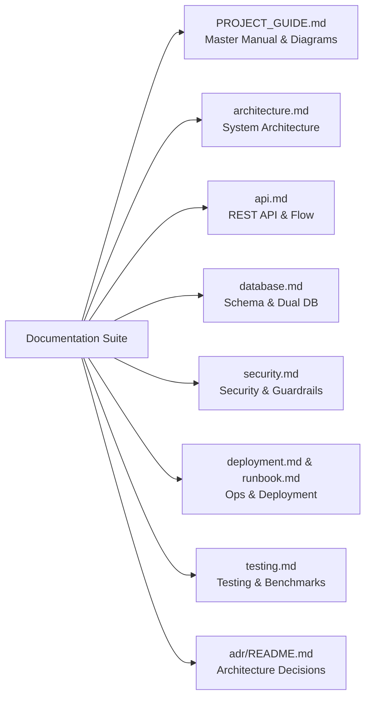

# Documentation Index

Welcome to the **Agent Red-Teaming & Evaluation Framework** documentation suite.

## Core Documentation Guides

| Guide | Description | Key Topics |
| :--- | :--- | :--- |
| [**Complete End-to-End Project Manual**](./COMPLETE_PROJECT.md) | **Step-by-step master manual** | Start-to-end user journey, complete API request/response payloads, running the project, database strategy |
| [**Master Project & Architecture Guide**](./PROJECT_GUIDE.md) | **Architecture & System Guide** | System overview, how to run, API flow, Database architecture, folder map, Mermaid diagrams |
| [**Architecture Documentation**](./architecture.md) | System design & component architecture | Layered architecture, subsystem breakdown, design principles |
| [**API Reference & Lifecycle**](./api.md) | REST API endpoints & schemas | Endpoints, authentication, request/response models, error formats |
| [**Database Architecture**](./database.md) | Database schema & data layer | SQLite vs PostgreSQL, SQLAlchemy models, tables, ER diagrams |
| [**Security & Threat Model**](./security.md) | Security defenses & threat taxonomy | OWASP Top 10 for LLMs, rate limiting, JWT RS256, MCP security |
| [**Deployment Guide**](./deployment.md) | Production setup & containerization | Docker, Kubernetes, Helm, cloud deployment, environment variables |
| [**Runbook & Operations**](./runbook.md) | Day-to-day operations & troubleshooting | Health checks, monitoring, database migrations, backup & recovery |
| [**Testing & Quality Assurance**](./testing.md) | Test suites & CI gates | Pytest, Jest, seeded regression benchmarks, CI/CD pipeline |
| [**Architecture Decision Records (ADRs)**](./adr/README.md) | Formal architectural decisions | System architecture, dual DB, provider pattern, evaluation strategy |

---

## Quick Navigation

