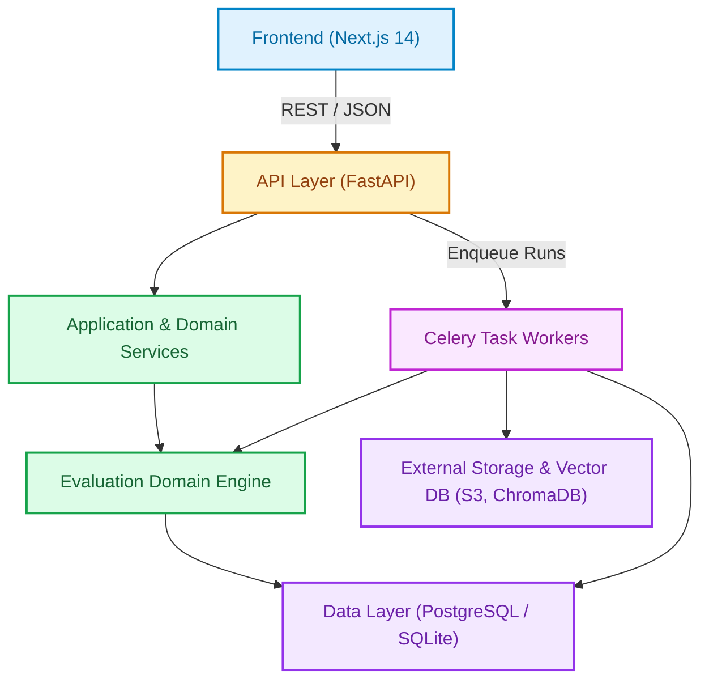

# ADR 001: System Architecture

## Status
Accepted

## Context
We need to define the overall system architecture for the Agent Red-Teaming & Evaluation Framework. The system must support:
- Continuous evaluation of AI agents against test suites
- Deterministic and LLM-based scoring
- Regression detection against baselines
- Human review workflow
- CI/CD integration with gate decisions
- Adversarial test generation
- Multi-turn red-team attacks
- Full observability and auditability

## Decision
We adopt a modular monolithic architecture with clear layer separation:

### Key Architectural Principles

1. **Deterministic First**: Safety-critical logic uses deterministic code. LLMs only where necessary.
2. **Fail-Closed**: Missing baselines, judge disagreements, infrastructure failures → FAIL/BLOCK
3. **Modularity**: Provider pattern for LLMs, embeddings, target agents, storage
4. **Versioning**: Independent versioning of suites, prompts, models, baselines
5. **Observability**: Structured logs, Prometheus metrics, OpenTelemetry tracing
6. **Security**: SSRF protection, PII redaction, RBAC, audit logging

## Consequences

### Positive
- Clear separation of concerns
- Testable layers
- Easy to extend (new matchers, judges, providers)
- Strong typing throughout
- Production-ready observability

### Negative
- More upfront complexity than simple monolith
- More components to deploy/monitor
- Requires understanding of provider pattern

## Alternatives Considered

### Microservices
- **Rejected**: Too much operational overhead for team size; domain is cohesive

### Serverless
- **Rejected**: Long-running evaluations (15-60 min) exceed limits; cold starts problematic

### Single-Layer Monolith
- **Rejected**: Hard to maintain, test, and extend; mixes HTTP handling with business logic

## Implementation Notes

### Layer Responsibilities

| Layer | Responsibility | Examples |
|-------|---------------|----------|
| Frontend | UI, state management, API client | Dashboard, run details, review queue |
| API | HTTP, auth, validation, serialization | FastAPI routes, Pydantic schemas |
| Services | Business logic, orchestration | SuiteService, ExecutionService, ScoringService |
| Domain Engine | Core evaluation logic | Matchers, Judges, RegressionDetector, GateEvaluator |
| Data | Persistence, caching, external adapters | SQLAlchemy, Redis, ChromaDB, S3 |

### Communication Patterns
- **API → Services**: Direct function calls (dependency injection)
- **Services → Domain**: Direct function calls
- **API/Services → Data**: Repository pattern
- **Async Jobs**: Celery tasks via Redis broker
- **External**: Provider interfaces (LLM, embeddings, target agent, storage)

### Data Flow
1. User creates run via API
2. API creates Run record, queues Celery task
3. Worker picks up task, calls ExecutionService
4. ExecutionService runs tests in parallel via target agent adapter
5. ScoringService scores each result (deterministic → LLM judge)
6. RegressionDetector compares with baseline
7. SeverityClassifier classifies findings
8. GateEvaluator makes final decision
9. ReviewQueue created for BLOCK/FAIL
10. Results stored, metrics emitted