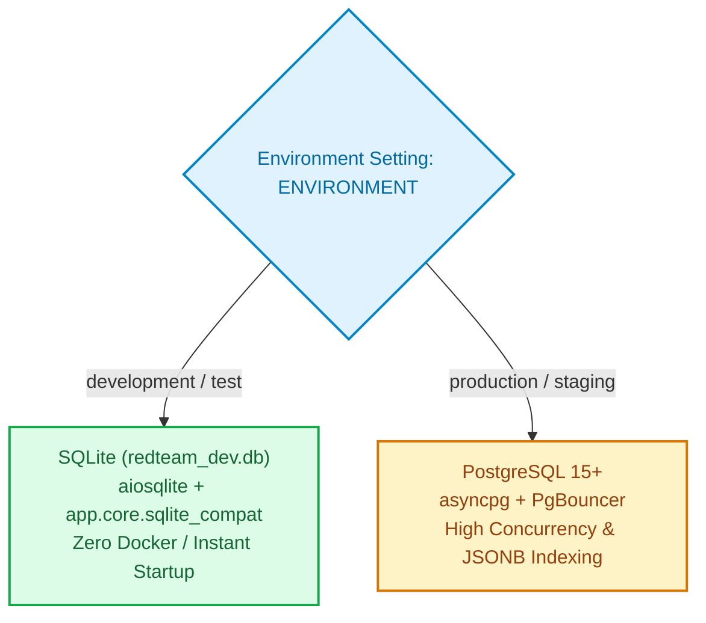

# ADR 002: Dual Database Strategy - PostgreSQL (Production) & SQLite (Development)

## Status
Accepted (Updated to Dual-Database Architecture)

## Context
We need a persistent relational data layer for the Agent Red-Teaming Framework. Requirements:
- ACID transactions for run execution, scoring, baseline approval, and human reviews
- Complex queries and joins across runs, results, regressions, and baselines
- JSONB support for flexible test configurations and execution evidence
- Native UUID primary keys across all entity models
- Zero-dependency local developer bootstrap (ability to run immediately without Docker)
- High-concurrency connection pooling in staging/production environments

## Decision
Adopt a **Dual-Database Architecture** powered by SQLAlchemy 2.0 async engine:
1. **Production & Staging**: Use **PostgreSQL 15+** with `asyncpg` driver.
2. **Local Development & Offline Testing**: Use **SQLite** with `aiosqlite` driver (`redteam_dev.db`), supported by the compatibility layer `app.core.sqlite_compat`.

### Database Selection Flow



## Rationale

### Why PostgreSQL for Production?
1. **ACID Compliance**: Full multi-version concurrency control (MVCC) for safety-critical evaluations
2. **JSONB & GIN Indexes**: First-class JSON querying and indexing for open-ended test payloads
3. **UUID Native Generation**: Fast in-engine `gen_random_uuid()`
4. **Connection Pooling**: Supports PgBouncer / enterprise pool configurations with 50+ concurrent workers

### Why SQLite for Development?
1. **Zero Configuration**: Developers and CI test runners can run tests without spinning up Docker or external database services
2. **Deterministic Test Isolation**: Fast database resets and file-based state replication
3. **SQLite Compatibility Layer**: `app/core/sqlite_compat.py` monkey-patches SQLite dialect to compile PostgreSQL JSONB and UUID column types seamlessly

### Positive
- Strong consistency for safety-critical operations
- Rich query capabilities for analytics/reporting
- Mature tooling for migrations, backups, monitoring
- Team familiarity reduces onboarding

### Negative
- Vertical scaling only (but sufficient for workload)
- Operational overhead (backups, vacuum, monitoring)
- Single writer bottleneck (mitigated by read replicas)

## Implementation

### Extensions
```sql
CREATE EXTENSION IF NOT EXISTS "uuid-ossp";
CREATE EXTENSION IF NOT EXISTS "pg_trgm";
CREATE EXTENSION IF NOT EXISTS "pg_stat_statements";
```

### Connection Pooling
- PgBouncer in transaction mode
- Pool size: 20, max overflow: 10
- Application-level pooling via SQLAlchemy

### Monitoring
- pg_stat_statements for slow queries
- pg_stat_activity for active connections
- Custom metrics: connection pool usage, replication lag

## Migration Strategy
- Alembic for schema migrations
- All migrations reviewed before apply
- Test upgrade/downgrade on staging
- Zero-downtime migrations where possible
- Separate data migrations from schema changes