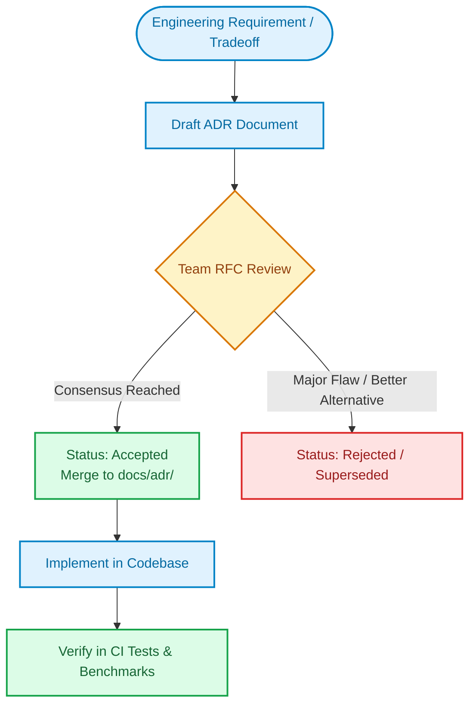

# Architecture Decision Records (ADRs)

This directory documents the key architectural decisions made for the **Agent Red-Teaming & Evaluation Framework**. Each record describes the context, decision, consequences, and alternatives considered.

## Decision Catalog

| ADR | Title | Status | Date | Key Decision |
| :--- | :--- | :--- | :--- | :--- |
| [**ADR 001**](./001-system-architecture.md) | **System Architecture** | `Accepted` | 2024-03-01 | Modular Monolithic architecture with layered separation of concerns and async workers |
| [**ADR 002**](./002-database-choice.md) | **Dual Database Strategy** | `Accepted` | 2024-03-05 | PostgreSQL 15+ for production concurrency; SQLite + `aiosqlite` for zero-setup local dev |
| [**ADR 003**](./003-provider-abstraction.md) | **Provider Abstraction Pattern** | `Accepted` | 2024-03-10 | Strategy & Factory patterns for LLMs, embeddings, target agents, and storage adapters |
| [**ADR 004**](./004-evaluation-strategy.md) | **Evaluation & Scoring Strategy** | `Accepted` | 2024-03-15 | Tiered evaluation: Deterministic Matchers first, LLM Judges with structured JSON second |

---

## Architectural Decision Workflow

