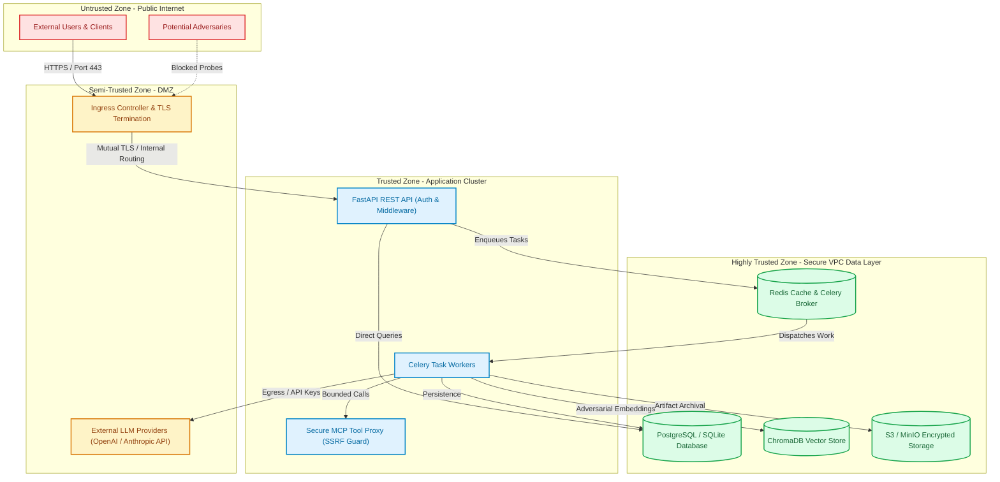
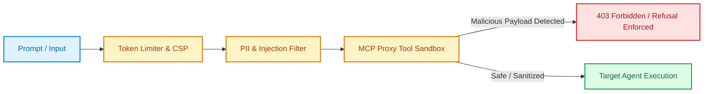

# Security Documentation

## Threat Model

### System Overview

The Agent Red-Teaming & Evaluation Framework is a security testing platform that evaluates AI agents against adversarial test cases. It handles sensitive test data, execution results, and security findings.

## Trust Boundaries & Network Segmentation



### Defense-in-Depth Pipeline



### Trust Levels
| Zone | Trust Level | Components |
|------|-------------|------------|
| Internet | Untrusted | External users, attackers |
| DMZ | Semi-trusted | Ingress, LLM providers |
| Application | Trusted | API, Services, Workers |
| Data | Highly Trusted | PostgreSQL, Redis, ChromaDB, S3 |

## Threat Analysis (STRIDE)

### Spoofing
| Threat | Impact | Likelihood | Mitigation |
|--------|--------|------------|------------|
| Stolen JWT tokens | Full account takeover | Medium | Short expiry (30m), RS256, rotation |
| Impersonate target agent | False test results | Low | mTLS, allowlist, health checks |
| Fake LLM provider | Manipulated scores | Low | Provider certs, response validation |
| Admin impersonation | System compromise | Low | MFA, audit logs, session limits |

### Tampering
| Threat | Impact | Likelihood | Mitigation |
|--------|--------|------------|------------|
| Modify test suites | False positives/negatives | Medium | Versioning, audit logs, RBAC |
| Alter baseline | Missed regressions | High | Approval workflow, immutable history |
| Inject malicious prompts | PII leakage, injection | Medium | Input validation, sanitization |
| Modify regression findings | Hide security issues | High | Audit trail, reviewer consensus |
| Change gate decision | Deploy unsafe agent | Critical | Deterministic logic, admin override audit |

### Repudiation
| Threat | Impact | Likelihood | Mitigation |
|--------|--------|------------|------------|
| Deny baseline approval | Accountability gap | Low | Immutable audit log, digital signature |
| Deny review decision | Avoid accountability | Low | Reviewer consensus, timestamped logs |
| Deny gate override | Bypass process | Low | Mandatory justification, dual approval |

### Information Disclosure
| Threat | Impact | Likelihood | Mitigation |
|--------|--------|------------|------------|
| Test suite leakage | IP exposure | Medium | RBAC, encryption at rest |
| Agent response PII | Privacy violation | High | Auto-detection, redaction, access control |
| LLM prompts/responses | IP, sensitive data | Medium | No default logging, encryption |
| Baseline data | Security posture | Medium | Access control, need-to-know |
| Audit logs | Operational security | Low | Admin-only, encrypted |

### Denial of Service
| Threat | Impact | Likelihood | Mitigation |
|--------|--------|------------|------------|
| API flood | Service unavailable | Medium | Rate limiting, WAF |
| Celery queue exhaustion | Workers overwhelmed | Medium | Queue limits, priority queues |
| LLM provider exhaustion | Evaluation failures | Low | Circuit breakers, fallbacks, budgets |
| Database connection exhaustion | All writes fail | Low | Connection pooling, limits |
| Storage exhaustion | Cannot save artifacts | Low | Quotas, monitoring, lifecycle policies |

### Elevation of Privilege
| Threat | Impact | Likelihood | Mitigation |
|--------|--------|------------|------------|
| Role escalation | Unauthorized access | Low | RBAC, audit on role changes |
| Admin bypass | Full system control | Low | MFA, approval workflow, audit |
| Worker compromise | Code execution | Low | Non-root containers, read-only FS |
| LLM prompt injection | Judge manipulation | Medium | Structured output, schema validation |

## Attack Scenarios

### Scenario 1: Malicious Test Suite
**Attack**: User uploads test suite with embedded prompt injection targeting judge LLM
**Path**: API → SuiteService → ScoringService → LLMJudge
**Mitigation**:
- Schema validation rejects unexpected fields
- Judge prompt separates system/user content
- Structured output prevents injection in response
- Input sanitization on test case content

### Scenario 2: SSRF via Target Agent
**Attack**: Register target agent with internal metadata URL (http://169.254.169.254)
**Path**: API → AgentService → HTTPTargetAgentProvider
**Mitigation**:
- URL allowlist (configurable)
- Private IP blocking (RFC1918, loopback, link-local)
- DNS rebinding protection (validate IP on each request)
- Scheme validation (HTTPS only in prod)

### Scenario 3: Judge Output Manipulation
**Attack**: Target agent returns crafted response that tricks judge into PASS
**Path**: Target Agent → ScoringService → LLMJudge
**Mitigation**:
- Double scoring with independent judge
- Structured output schema validation
- Evidence requirement for PASS/FAIL
- Confidence threshold for acceptance

### Scenario 4: Baseline Tampering
**Attack**: Modify baseline to hide known regression
**Path**: API → BaselineService → BaselineRepository
**Mitigation**:
- Baseline approval requires admin role
- Immutable history (baseline_items never updated)
- Audit log on all baseline actions
- Review queue for regression acknowledgment

### Scenario 5: PII Exfiltration via Reports
**Attack**: Generate report containing unredacted PII, download via API
**Path**: API → ReportService → StorageProvider
**Mitigation**:
- PII detection before storage
- Redaction by default
- Elevated permissions for unredacted access
- Audit log on report generation

### Scenario 6: Cost Exhaustion
**Attack**: Trigger many evaluations to exhaust daily budget
**Path**: API → Run Creation → Celery Workers
**Mitigation**:
- Per-run cost limit
- Daily cost limit with hard stop
- Rate limiting on run creation
- Alerting on budget thresholds

## Security Controls Matrix

| Control | Implementation | Verification |
|---------|---------------|--------------|
| Authentication | JWT RS256, 30m access, 7d refresh | Penetration test |
| Authorization | RBAC with 6 roles, resource-level | Unit/integration tests |
| Input Validation | Pydantic v2 strict schemas | Fuzzing, property tests |
| Output Encoding | JSON only, no template injection | Code review |
| SQL Injection | ORM only, no raw queries | Code review |
| XSS | Content-Type headers, CSP, sanitization | SSL Labs, CSP eval |
| CSRF | SameSite cookies, CSRF tokens for forms | OWASP ZAP |
| SSRF | URL allowlist, private IP blocking, DNS rebinding protection | Unit/integration tests |
| File Upload | Type validation, size limits, scanning | DAST |
| Rate Limiting | Per-endpoint, per-user, global | Locust load test |
| CORS | Explicit allowlist, no wildcards | Browser dev tools |
| Security Headers | HSTS, X-Frame-Options, X-Content-Type-Options | SSL Labs, securityheaders.com |

## Vulnerability Management

### Dependency Scanning
```bash
# Python
pip-audit --format=json
bandit -r app -f json

# Node.js
npm audit --json

# Container
docker scan redteam-backend:latest
```

### CI/CD Integration
- **Pre-commit**: ruff, bandit, secret detection
- **PR**: Full scan on every PR
- **Scheduled**: Daily dependency scan
- **Release**: Full scan before deployment

### Patch Management
- **Critical**: 24 hours
- **High**: 72 hours
- **Medium**: 30 days
- **Low**: Next release cycle

## Incident Response

### Security Incident Classification
| Severity | Response Time | Escalation |
|----------|---------------|------------|
| Critical (P0) | 15 minutes | CISO, Legal, PR |
| High (P1) | 1 hour | Security Lead, Engineering Lead |
| Medium (P2) | 4 hours | Security Team |
| Low (P3) | Next sprint | Security Team |

### Playbooks

**Data Breach**
1. Contain: Revoke tokens, isolate affected systems
2. Assess: Determine scope, data types, affected users
3. Notify: Legal, regulators (GDPR 72h), affected users
4. Remediate: Patch vulnerability, rotate credentials
4. Review: Post-incident, update controls

**Privilege Escalation**
1. Detect: Audit log alert on role changes
2. Investigate: Timeline, affected resources
3. Revoke: Remove unauthorized access
4. Rotate: All potentially compromised credentials
5. Review: RBAC configuration, approval processes

**Supply Chain Attack**
1. Identify: Affected dependencies, versions
2. Isolate: Pin known-good versions
3. Scan: All environments for indicators
4. Update: Apply patches, rebuild images
5. Verify: Re-run security scans

## Compliance Mapping

| Requirement | Control | Evidence |
|-------------|---------|----------|
| SOC 2 CC6.1 | RBAC, MFA, audit logs | Access reviews, log samples |
| SOC 2 CC7.2 | Monitoring, alerts, IR | Alert history, drill records |
| GDPR Art. 32 | Encryption, PII detection, DPIA | Encryption config, scan results |
| ISO 27001 A.12.6 | Vulnerability management | Scan reports, patch logs |
| NIST CSF | Identify, Protect, Detect, Respond, Recover | Playbooks, exercise records |

## Security Checklist

### Pre-Deployment
- [ ] All secrets in secret manager
- [ ] TLS certificates valid > 30 days
- [ ] Network policies applied
- [ ] RBAC configured correctly
- [ ] Rate limits configured
- [ ] PII detection enabled
- [ ] Audit logging verified
- [ ] Backup/restore tested
- [ ] Security scan passed
- [ ] Penetration test scheduled

### Ongoing
- [ ] Daily: Dependency scans
- [ ] Weekly: Vulnerability scans, log review
- [ ] Monthly: Access review, compliance report
- [ ] Quarterly: Key rotation, pen test
- [ ] Annually: Full security audit, DR test